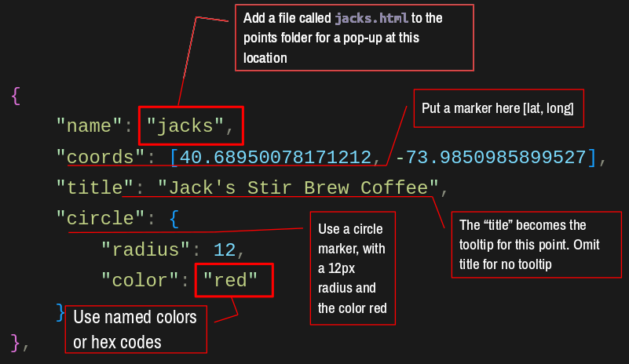

Video: Map Markers in Leaflet
=============================

<div class="ratio ratio-16x9">
<iframe src="https://www.youtube.com/embed/IwdHPU1trk0?si=TnS6tlWyix3J7ms4" title="YouTube video player" frameborder="0" allow="accelerometer; autoplay; clipboard-write; encrypted-media; gyroscope; picture-in-picture; web-share" allowfullscreen></iframe>
</div>

**[Click here to open the code in Codesandbox](https://codesandbox.io/p/sandbox/smoosh-glade-z6qnp5)**

`points.js`
-----------


In this Javascript configuration file you will be able to:

- add point locations to your map
- set the marker style
  - default
  - circle
  - custom
- add a tooltip to your marker

```javascript

// this example has 3 points

let points = [
    {
        "name": "sfc",
        "coords": [40.6903, -73.9863],
        "title": "Adelphi Brooklyn Center @ St Francis College",
        "icon": AUIcon
    },
    {
        "name": "jacks",
        "coords": [40.6895, -73.9851],
        "title": "Jack's Stir Brew Coffee",
        "circle": {
            "radius": 12,
            "color": "blue"
        }
    },
    {
        "name": "devocion",
        "coords": [40.6886, -73.9834],
        "title": "Devoción Coffee"
    }
]
```


- `name` (required) is a unique identifier for the point and must match the pop-up html (if you want a pop-up)
- `coords` (required) the latitude and longitude of the point
- `title` (optional) the text that will appear in the tooltip
- marker style
  - `icon` (optional) the custom icon to use for the marker
  - `circle` (optional) the style of the circle marker
  - if no style is set, the default marker will be used

Custom Marker Icons
-------------------
```javascript
const AUIcon = L.icon({
    iconUrl: "/img/au.png",
    iconSize:     [64, 54], // size of the icon
    iconAnchor:   [32, 27], // point of the icon which will correspond to marker's location
    popupAnchor:  [-3, -76] // point from which the popup should open relative to the iconAnchor
});
```

To create a custom icon:

1. Create (or find) the icon image (png, jpg, gif, or svg)
2. On your computer, scale it to the desired size (more or less)
3. Upload it to the `/img` directory in your project root
4. Create a new icon using the `L.icon` method (example above)
   - the variable name (`AUIcon`) should a good, short, valid name that describes the icon
     - use it every time you want to use the icon
   - `iconUrl` is the path to the image, must match exactly including the path and the case
   - `iconSize` is the size of the image in pixels, [`width`, `height`]
   - `iconAnchor` is the point on the image that will be placed relative to the marker's location (x, y relative to the anchor)
   - `popupAnchor` defines the offset from the pop-up and the anchor point
