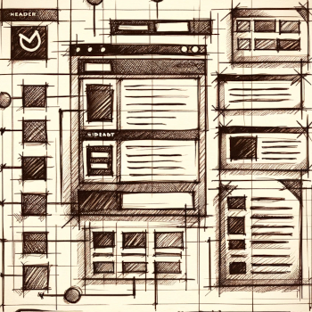

Web Dev Resources
=================

Docs & Examples
----------------
- [Mozilla Developer Network HTML Docs](https://developer.mozilla.org/en-US/docs/Web/HTML)
- [Mozilla Developer Network CSS Docs](https://developer.mozilla.org/en-US/docs/Web/CSS)
- [Mozilla Developer Network Javascript Docs](https://developer.mozilla.org/en-US/docs/Web/javascript)
- [HTML Cheat Sheet](https://digital.com/html-cheat-sheet/)
- [World Wide Web Consortium](http://w3.org) [_official specs_]
- [W3 Schools](http://www.w3schools.com/)

Design
------
- [Adelphi Style Guide](https://www.adelphi.edu/brand/)
  - [Graphik Font](https://commercialtype.com/catalog/graphik)
- **Color**
  - <https://colorhunt.co/>
  - <https://coolors.co/>
  - <https://colorable.jxnblk.com/>
  - <https://www.khroma.co/>
  - <https://mycolor.space/>
  - <https://color.adobe.com>
  - [Named Web Colors](https://developer.mozilla.org/en-US/docs/Web/CSS/named-color)
- **Design Inspiration**
  - [Dribbble](http://dribbble.com/)
  - [Behance](http://www.behance.net/)
  - [Awwwards](http://www.awwwards.com/)
  - [Webby Awards](https://www.webbyawards.com/)
  - [Deviant Art](http://www.deviantart.com/)
- [A List Apart](http://alistapart.com/topic/html)
- [Smashing Magazine](http://www.smashingmagazine.com/)

Accessibility / Usability / UX
-------------------------------
- [Nielsen/Norman Group](http://www.nngroup.com/articles/)
- [United States Section 508](http://en.wikipedia.org/wiki/Section_508_Amendment_to_the_Rehabilitation_Act_of_1973)
  - [https://www.section508.gov/](https://www.section508.gov/)
  - [http://webaim.org/standards/508/checklist](http://webaim.org/standards/508/checklist)
- [Usability.gov](http://www.usability.gov/index.html)
- [w3c HTML Validation Service](http://validator.w3.org/#validate_by_uri+with_options)
- [w3c CSS Validation Service](http://jigsaw.w3.org/css-validator/)

Learning / Courses
------------------
Short and long courses and training materials. LinkedIn Learning is free for Adelphi students.

- LinkedIn Learning [sign into ecampus first]
  - [HTML Courses](https://www.linkedin.com/learning/topics/html?u=56671577)
  - [Javascript Developer](https://www.linkedin.com/learning/roles/javascript-developer?u=56671577)
  - [Web Developer](https://www.linkedin.com/learning/roles/web-developer?u=56671577)
  - [Web Design](https://www.linkedin.com/learning/topics/web-design?u=56671577)
- [Khan Academy::Intro to HTML/CSS: Making webpages](https://www.khanacademy.org/computing/computer-programming/html-css)
- [Code Academcy](http://www.codecademy.com/)
- [General Assembly Dash](https://dash.generalassemb.ly/)

Media Resources
----------------
Open License Media and royalty free resources.

### Fonts
- [dafont](http://www.dafont.com/)
- [Google Fonts](https://fonts.google.com/)
- [Font Awesome](http://fontawesome.io/)
- [Adobe Fonts](https://fonts.adobe.com/)
- [Font Squirrel](https://www.fontsquirrel.com/)

### Images, Video, Audio, Icons
- [The Noun Project](http://thenounproject.com/), icons
- [Pixabay](https://pixabay.com/), royalty free images and videos
- [Open Clip Art](https://openclipart.org/), free vector graphics
- [Unsplash](https://unsplash.com/), free high resolution images
- [Pexels](https://www.pexels.com/), free stock photos and videos
- [Wikimedia Commons](http://commons.wikimedia.org/wiki/Main_Page), images and other media (including stuff from Wikipedia), curated
- [Creative Commons Search](http://search.creativecommons.org/), for images, music, etc
- [Creative Commons Music](http://creativecommons.org/music-communities)
- [Fossil Bank](http://fossilbank.wikidot.com/)

Software/Tools
---------------
- [Replit](https://replit.com) _online code editor_
- [Codesandbox.io](https://codesandbox.io) _online code editor_
- [Figma](https://www.figma.com/) _wireframes / mockups_
- [Chat GPT](https://chat.openai.com/) _AI chatbot_
- [Gemini](https://gemini.google.com) _AI chatbot_
- [GIMP](https://www.gimp.org/) _image editing_
- [Inkscape](https://inkscape.org/) _vector graphics_
- [Audacity](https://www.audacityteam.org/) _audio editing_
- [OBS Studio](https://obsproject.com/) _screen recording_
- [Dr. Curinga's Guide to Free Open Source multimedia software](https://www.mixi.nyc/post/foss-multimedia-toolkit)
- Color pickers: [[Mac](https://www.makeuseof.com/tag/color-picker-apps-mac/)] [[Windows](https://helpdeskgeek.com/windows-11/how-to-get-and-use-the-windows-color-picker/)]