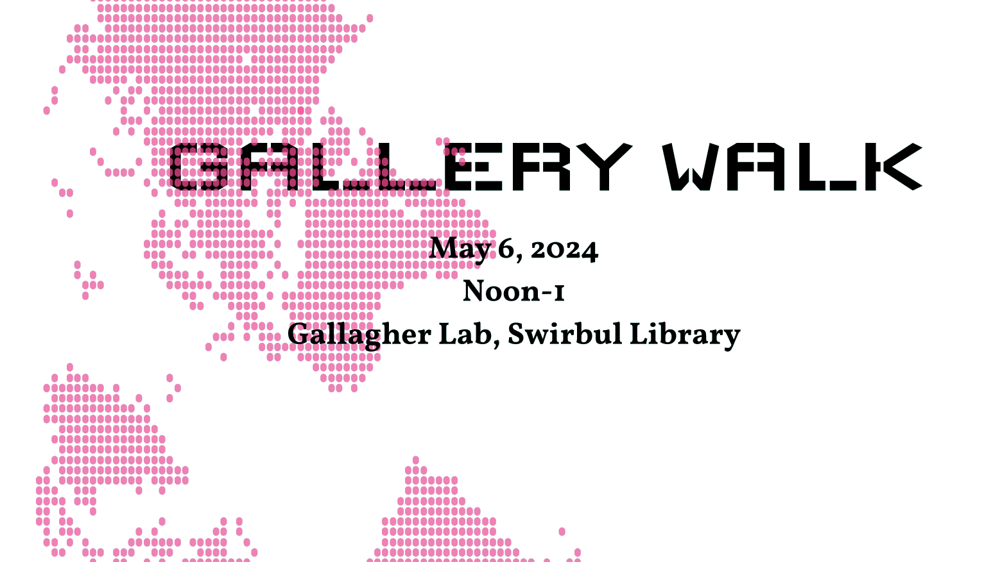

<b>Adelphi University</b> 
+ the Department of Communications 
+ <strong>Spring 2024 New Media</strong> 
the seminar students 
cordially invite you to attend our 
semester’s end. 

In partnership with the **Mozilla Foundation** & 
their **Responsible Computing Challenge** partners, 
please come and enjoy light food and 
beverage, but more importantly, student 
work for greater 
**design** + **code** spatial justice. 

- - - - 

The Projects
------------

1. [Russian Heritage](https://glkzll.csb.app)
2. [Wealth & Voter Turnout in NYC](https://0d8ee14e-8467-4d8f-8c12-8e12c5a3f89c-00-17ps58bexvc3c.picard.replit.dev/) [[code](https://replit.com/@jakesands/New-Media-Final-Project-NYC-Wealth-and-Politics-1)]
3. [Solar Rays](https://d10b14fb-de48-48f3-a476-ccd07af6c426-00-3ukfr9owlfjci.janeway.replit.dev/)
4. [Gender Wage Gap](https://8831f81a-91b9-4ffd-b604-80abcdf2b79d-00-328yxa9898cxy.riker.replit.dev/) [[code](https://glkzll.csb.app)]
5. [Japan's Declining Birth Rates](https://5rl2zm.csb.app/)
6. [Bikes]()
7. [School Lunch]()
