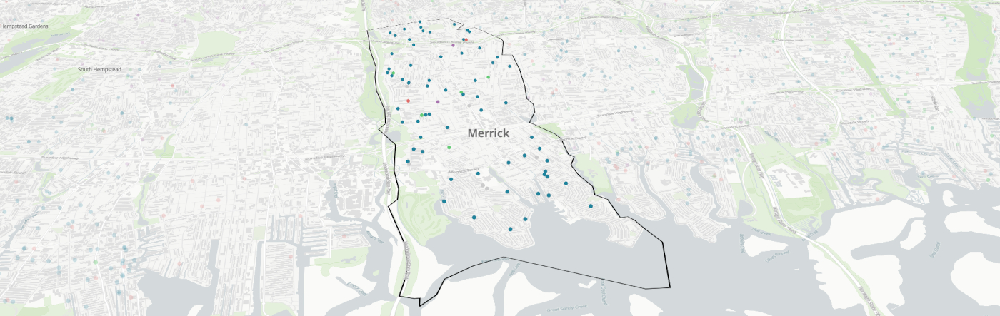

Week 3: School Segregation Continued
====================================

<h2><i class="bi bi-book text-primary"></i> Seminar: Monday, Feb 05</h2>

**Goals:** Consider the relationship between real estate, housing, and school segregation. Look at "active" and "passive" segregation and how it is maintained. Discuss how spatial design and data visualization can be used to tell a story about segregation.

### Readings due:
- Carrozzo, A. (2019, November 17). [Undercover investigation reveals evidence of unequal treatment by real estate agents](https://projects.newsday.com/long-island/real-estate-agents-investigation/). _Newsday_.

### Agenda:
1. Space and Design
2. Reading Discussion
3. Assignment 1 Questions
4. Lab Preview

- - - -

<h2><i class="bi bi-filetype-html text-primary"></i> Lab: Wednesday, Feb 07</h2>

**Goals:** In this lab we will look at how to include images, audio, and video in our web pages, and how to use CSS to style our pages. We will also learn how to code our pages so they can be plotted as a point on a map.

### Optional Readings and Resources:

- [MDN: Dealing with files](https://developer.mozilla.org/en-US/docs/Learn/Getting_started_with_the_web/Dealing_with_files). Where should the files go for your website?
- [MDN: CSS Basics](https://developer.mozilla.org/en-US/docs/Learn/Getting_started_with_the_web/CSS_basics)
  - [Text & Fonts](https://developer.mozilla.org/en-US/docs/Learn/CSS/Styling_text) [[add your own fonts](https://developer.mozilla.org/en-US/docs/Learn/CSS/Styling_text/Web_fonts)]
  - [Centering things](https://developer.mozilla.org/en-US/docs/Learn/CSS/Howto/Center_an_item)
- [MDN: Named Colors](https://developer.mozilla.org/en-US/docs/Web/CSS/named-color)

### Agenda:
1. Demos:
    - adding an image (or font, audio, video, other media)
    - including CSS
    - CSS selectors
    - box model: width, height, padding, margin, border
      - horizontal centering (`margin: 0 auto`)
    - "containers": 
, , <main>, <section>, <nav>, <header>, <footer>
    - adding background colors and images
    - adding a map point
    - AI chat for help
2. Practice:
   - open and "fork" the [Mapping Points Codesandbox] (TBD)
   - add 2 new web pages to your school project
   - incorporate the new elements we learned about today
   - look up some other CSS properties and try them out
   - plot your HTML on the map
   - share on Discord

### Readings out
(_due before next class_)

- _seminar_
    - Wines, M. (2019, June 27). [What Is Gerrymandering? And How Does It Work?](https://www.nytimes.com/2019/06/27/us/gerrymander-explainer.html) _The New York Times._
    - Meyers, D. (2019, November 7). [Experts identify the worst examples of gerrymandering.](https://thefulcrum.us/worst-gerrymandering-districts-example) _The Fulcrum._ [blog]

- _lab_
    - TBD
