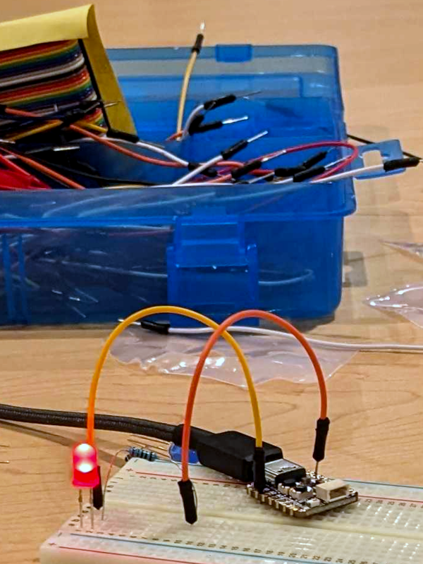
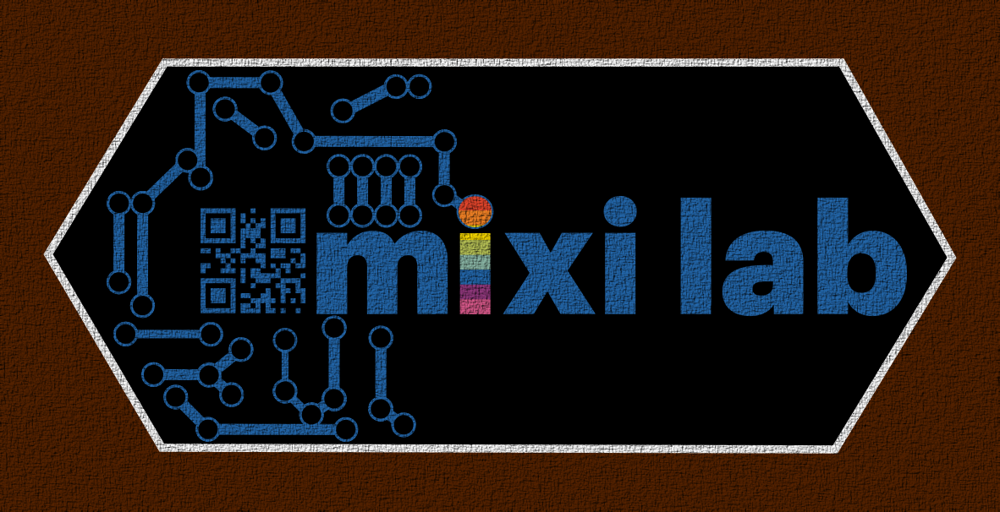
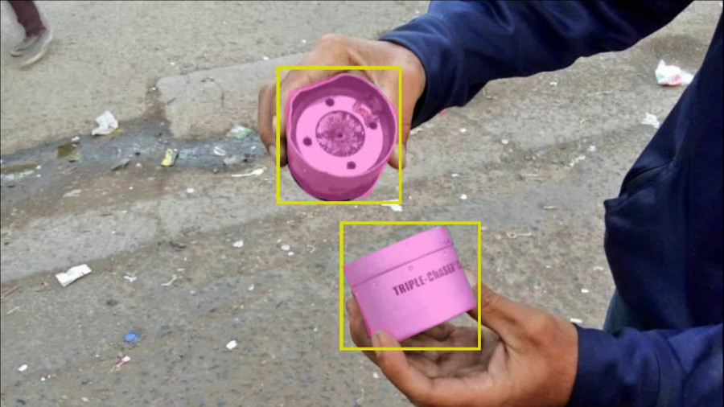

<h4 class="muted d-block text-center">Summer 2024</h4>
<h1 class="border-bottom border-4 border-black">Maker Lab 1: Design Lab</h1>

   

      <strong>Keywords:</strong> art, aesthetics, politics, creativity, design, STEAM, maker education, sewing, scratch, hard fun
   

   
STEAM Teaching and Learning ESM 501, 3 credits

   



Instructors:

- Matthew X. Curinga [<mcuringa@adelphi.edu>] 
- Eric Miles [<emiles@adelphi.edu>]

Materials:

There are no required textbooks for this course. All course materials
will be provided at class meetings.



{{ md | markdownify }}



Meetings:

- Monday & Wednesday, 4pm-7pm
- Saturday (6/8 & 6/15), 10am-4pm

Location:

[Adelphi Brooklyn Center](https://maps.app.goo.gl/hoyDaxxm8MHbjjCeA)
Room 7122 (7th floor maker lab)


{{ md | markdownify }}

<b style="font-weight: bold">In the Design Lab</b> 
students encounter the big ideas in Maker Education and STEAM as
well as the practices of the maker lab. Emphasis is placed on
engagement in and critique of the practice of “making” through
foundational literature and hands on studio culture with a focus on
creativity and learning.


<h4>Goals</h4>

1. Students will explore and analyze foundational and contemporary theories and
   approaches of MakerEd and STEAM texts and respond through a series of written,
   audio and video prompts.
2. Students will engage conceptual, aesthetic, and practical aspects of MakerEd and
   STEAM through the generation and production of a series of material and digital 
   prototyping and final projects. This includes creative problem-solving, 
   collaboration and critical inquiry as they 'make' with others. Both processes and 
   final work will be included in student-created digital portfolios.
3. Students will analyze and evaluate the role of MakerEd and STEAM theories and 
   practices in educational settings through a final interactive online zine that 
   curates their learning across the course.value
4. Students will have fun and experience joy in learning, understanding and 
   demonstrating the role of play, risk-taking and experimentation in making and 
   creating in MakerEd and STEAM environments.



{{ md | markdownify }}


<h2>Class schedule</h2>
This is an intensive, summer course where we squeeze a full semester's worth of
work into two weeks! Weekday classes run from 4pm-7pm, and our two Saturday sessions
will run from 10am-4pm. In addition to class meetings, you will need to spend time
outside of class in the maker lab, and arrange time to complete your museum visits.

**Readings listed below are due for that class session, including our first meeting.**
Please come to class prepared to discuss the readings.

{{ md | markdownify }}

<table>
<tr>
   <th>#</th>
   <th>date</th>
   <th>topic</th>
   <th>readings</th>
</tr>

<tr>
   <td>{{ session.number }}</td>
   <td>{{ session.date }}</td>
   <td>{{ session.title }}</td>
   <td>{{ session.readings }}</td>
</tr>

</table>

<h2>Readings</h2>


Cipolla, C. (2019). Build It Better: Tinkering in Feminist Maker Pedagogy. _Women’s Studies_, _48_(3), 261–282. [[pdf](https://drive.google.com/file/d/1WN-fviW3BUMc5LHqz39bH2Z8YVf9o0AG/view?usp=drive_link)]

Forensic Architecture, & Poitras, L. (Directors). (2019). [Triple Chaser](https://forensic-architecture.org/investigation/triple-chaser/) [Documentary, Short]. Praxis Films.

Ladson-Billings, G. (2011). “Yes, But How Do We Do It?”: Practicing Culturally Relevant Pedagogy. _In White Teachers / Diverse Classrooms (2nd ed.)_. Routledge. [[pdf](https://drive.google.com/file/d/1Lrl-N94ytbukzsrUpeJN3yuJTuOI9bSg/view?usp=drive_link)]

Martinez, S. L., & Stager, G. (2013).Chapter 1: An Insanely Brief and Incomplete History of Making. In _Invent to learn: Making, tinkering, and engineering in the classroom_. Constructing Modern Knowledge Press. [[pdf](https://drive.google.com/file/d/1eruhyafUFMLE6FSbMVg_PiEbP6O6q5IM/view?usp=drive_link)] [[epub](https://drive.google.com/file/d/1a5LxUAptVrHX7f8zwU92nxBl6qb8SUej/view?usp=drive_link)]

Noddings, N. (2013). Standardized Curriculum and Loss of Creativity. _Theory Into Practice_, _52_(3), 210–215. [[pdf](https://drive.google.com/file/d/1dUgpl9_18ybk9AvPX-ohRRq-df_jZtmh/view?usp=drive_link)]

Greene, M. (1977). The Artistic-Aesthetic and Curriculum. Curriculum Inquiry, 6(4), 283–296. [[pdf](https://drive.google.com/file/d/1o7dbDPtNlDjv3Z29JsXR9DKMIbRJZyI4/view?usp=drive_link)]

O’Brien, K. C. (2021). Fibre Artists and Outsider Algorithms: Rethinking Ethnomathematics Through Contemporary Craft. _For the Learning of Mathematics_, _41_(1), 8–13. [[pdf](https://drive.google.com/file/d/1SCbf62q4r79iYqMdNb9vw7RHSTn2LhU_/view?usp=drive_link)]

Papert, S. (1991). Situating constructionism. In I. Harel & S. Papert (Eds.), _Constructionism_ (pp. 1–10). Praeger. [[mit.edu](https://web.media.mit.edu/~calla/web_comunidad/Reading-En/situating_constructionism.pdf)]

Papert, S. (2002). [Hard Fun](maker3/hard-fun.html). _Bangor Daily News_. Bangor, ME. Bangor Daily News.

Runco, M. A., & Jaeger, G. J. (2012). The Standard Definition of Creativity. _Creativity Research Journal_, _24_(1), 92–96. [[pdf](https://drive.google.com/file/d/1Lyi8RErUoKnhA6ISvoIT3LDRNNSfxEqD/view?usp=drive_link)]



{{ md | markdownify }}


Assignments
------------

Assignment            | Due Date | Points
----------------------|----------|--------
Participation         | Ongoing  | 10
Artist's Journal      | Ongoing  | 10
Museum Visits         | Ongoing  | 10
Public Art Encounters | Ongoing  | 10
Reading responses     | Ongoing  | 10
Maker Lesson          | June 15  | 10
Maker Vest            | June 12  | 15
Scratch Story Game    | June 19  | 15
Online Portfolio      | June 19  | 10

{{ md | markdownify }}



### Participation
A _class_ is a place where we study together. Your
participation will help make this a great class.

To get full participation points:

1. **Attend every class session.** This is a short course and there
   are no excused absences outside of medical exemptions with a doctor's
   note, modification from the Student Access Office, or
   a religious holiday.
2. **Don't be late. Don't leave early.**
3. **Do the readings.** Come to class prepared to discuss the readings.
   If it's obvious that you didn't do the readings, or made little effort
   to engage with or try to understand them, you will lose participation points.
4. **Maintain the lab.** We are all responsible for maintaining the maker lab, closet,
   and our materials. Help us set up, help keep things clean and organized, help
   us put things away.
5. **Be bold.** This is a class about creativity and making. We want you to take risks,
   to try new things. _This is not an easy thing!_ 
6. **Be kind and respectful.** We love a spirited debate, strong opinions, and
   learning new things from each other. But those practices only work if we
   offer our respect to the other participants and assume they are operating
   in good faith, too.Reading responsesReading reReading responsessponses
7. **Communicate.** Read your emails. Post on Discord. Talk to your partners.
   Let the instructors know if there's a problem or question. Tell us how to
   make things better.

### Artist's Journal
Everyone will keep an Reading responsesartist's journal during this course
(and after, we hope). The Journal is a place for you to record
thoughts, plan designs, sketch ideas, and reflect. There will
be some "assigned" journal entries (see below), but mostly
it is meant for your own benefit. Journaling might not be for you...
but for the purpose of this course, try it out with an open mind.

To "grade" your journal, you will upload photos of key pages to 
your online portfolio and write a brief (~500 word) reflection 
about how you used it, and what you thought of the journal.

### Museum Visits
You will visit (at least) 3 museums outside of course hours. Each visit
must be at least one hour long. You must keep journal entries for each
visit that log the museum, the date and time of the visit, and key
exhibitions or works that you engaged with. You should also document
your visit with sketches, photos, and videos. You will create an
entry on your online portfolio for each visit. Your entries
should reflect on the visit in terms of course readings and discussions,
including considering how the museums work as public pedagogy, the learning
design, the aesthetic experience, politics of the museum, etc.

You _must_ visit at least one of the following "STEM" museums:

- [New York Hall of Science](https://nysci.org/)
- [MoMath: Museum of Mathematics](https://momath.org/)
- [Museum of the Moving Image](http://www.movingimage.us/)
- [American Museum of Natural History](https://www.amnh.org/)

You can use your library card (New York, Brooklyn, or Queens) to get free
[culture pass](https://www.culturepass.nyc/) to many museums in the city.
Even if you can't take advantage during our short course, it is a great
resource.

The instructors will post other interesting museum exhibits and events
on Discord as well as invitations to join us for informal, optional fieldtrips
during the course. You can also check out the [NYC Arts Calendar](https://www.nyc-arts.org/)
for further ideas and events.

### Maker Lesson
You will read the New York State and professional standards
for your content area (Math, Biology, Physics, Comp Sci, etc.)
as well as the Art Standards. You will create your own lesson
plan that addresses one of the standards from your content
area and one of the art standards. Your lesson must incorporate
key ideas of maker education and steam learning. The instructors
will provide links to sample lesson plans as well as example templates
for creating a lesson plan.

Plan a lesson for a 45 minute class.

At the very least, your lesson plan
must include the following items:

- a brief narrative describing what happens before and after this lesson
- learning goals and standards covered in the lesson
- materials list
- a timeline of activities
- how the lesson will be assessed
- any instructor created materials (slides, handouts, examples)

You will submit your lesson as a Google Doc shared with the instructors,
with links to all external materials and resources.

The lesson will be evaluated on the following criteria:

- creativity of the lesson
- alignment with standards
- integration with maker and steam learning
- viability of the lesson in a classroom setting

_Optionally add your lesson plan to your portfolio._



{{ left_col | markdownify }}


### Public Art Encounters
New York is full of public art: famous sculptures, big shows, 
street art, hidden and half forgotten works, and more. 
You will document at least 3 public art works that you 
encounter. At least one of these should be "sanctioned"
work and at least one should be "unsanctioned" work.

Document your encounter in your journal with at least
one sketch of each work, and notes on the context,
your experience, and thoughts on the work. Further
document your encounter with photos and videos. Consider
things like the medium of the work, the scale (aka size),
the materials, when it was created, how it was funded ( or not).

Upload your documentation to your online portfolio.

### Reading Responses
For each reading, you will write a "reading response" in
your journal prior to the class session (except for the first
meeting -- we will write them in class). Your response **must**
include a 150 word summary of the reading, it should also include
notes, questions, reference to key passages, and your thoughts.

Reading responses will be checked by the instructors at the
start of each class. For some sessions you will read your
response aloud or share with a partner.

### Maker Vest
We are all going to make a vest. Working from patterns provided,
you will design your own vest, cut the fabric, and sew it together.
You will design an embroidery or patch for your name, and also
a decorative design for the back of the vest. The vests will include
"wearable" technologies powered by Adafruit Qt Py microcontrollers.
Your technology integration can be playful, aesthetic, or functional.

In addition to the patch and tech, you will must also design and 3D
print an element for your vest. This could be a button, a zipper pull,
a buckle, or something else.

We will begin working on the vests during our first Saturday session,
but you will need to spend time outside of class to complete the project.

Your vest will be evaluated on:

- the quality of your craft
- the innovations found in your design (don't just copy something your found online)
- the demonstration your ability with the tools of the maker lab:
  - microcomputer
  - circuits
  - 3D design and printing

### Scratch Story Game
The [Scratch](https://scratch.mit.edu/) programming language is
many students' first introduction to computer science and computer
programming. Scratch is the direct descendent of the Logo programming;
Seymour Papert's constructionist programming language.

For this project you will work in a **team of two** to design,
code, and test a "story game" in Scratch. You will create
original art for your game as vector graphics, create a 
compelling narrative to drive the game, and incorporate
puzzles, challenges, and other interactive elements.

Your will build your game on top of our Scratch game platform
which will make provide basic mechanics such as keeping
track of active scenes, inventory, score, etc. You will not just
create a game, but a game-for-learning (aka _serious game_)
that incorporates elements of your content area.

To complete this assignment, you will submit your public game
on Scratch. Each team member will also submit a reflection
on their portfolio site that describes the content areas
addressed, the theory behind the game (why is it fun? who is it for?
how does it _teach_?). Also discuss the development and game
testing process. Finish your reflection with ways that you could
improve the game.

Your game will be evaluated on:

- **Risk & Creativity:** does your game try to do something new?
- **Fun:** how well does it work as a game?
- **Story:** does the story make sense? are the characters compelling? does the player make real choices?
- **Art & Design:** does the game visually and aesthetically enhance the learning and story goals? are the developers able to create a polished look and feel?
- **Programming:** do the developers demonstrate understanding of key CS concepts such as loops, conditionals, variables, events, functions, and parallelism? do they understand key Scratch concepts such as sprites, costumes, and backdrops?
- **Learning:** does the game teach something? is it _worth_ teaching? are the "play" and "learning" elements integrated?

### Online Portfolio
You will create an online portfolio that will be used throughout
the Master's in STEAM Teaching and Learning. While the portfolio
will house many of your assignments, you are also responsible for
designing a site that reflects your identity as a maker and educator.

The portfolios will be created using Google Sites with your Adelphi
email account. You will be responsible for maintaining the site
permissions and making sure that it is available to the instructors
and other students in the class, and that some aspects (at least)
are fully public. Everyone is encouraged to use Google Sites, but
if you have a strong preference for another platform, you
can use it once you have instructor approval.

Your portfolio will be evaluated on how well you demonstrate your 
ability to use the features of your online platform, you ability
to achieve a consistent and professional design and user experience, 
the quality of your content (well edited writing, thoughtful images, 
clear audio, etc), and the overall creativity and originality of your site.



{{ right_col | markdownify }}

<h2>Session 1: STEAM & Maker Ed</h2>
<strong>Mon, Jun 3, 4pm-7pm</strong>


In our **first meeting** we will get to know each other, a feeling
for the main goals of the class, and start to play around with
some of the tools and methods we will be using in this summer
course. We will make sure that everyone has their online
portfolio up and running, and that everyone has started their
artist's journal.

**Goals:**

- Understand the goals of the course
- Get to know each other and the instructors
- Develop basic vector graphic design skills
- Cut stencils with the Cricut
- Begin an online portfolio

**Agenda:**

1. Welcome
2. Reading discussion
3. Cricut Stencils & Spray Paint
4. Google Sites & Online Portfolis
5. Journal Design / Site Design


{{ md | markdownify }}


**Due:**

- **Read**
  - Martinez, S. L., & Stager, G. (2013).Chapter 1: An Insanely Brief and Incomplete History of Making. In _Invent to learn: Making, tinkering, and engineering in the classroom_. Constructing Modern Knowledge Press. [[pdf](https://drive.google.com/file/d/1eruhyafUFMLE6FSbMVg_PiEbP6O6q5IM/view?usp=drive_link)] [[epub](https://drive.google.com/file/d/1a5LxUAptVrHX7f8zwU92nxBl6qb8SUej/view?usp=drive_link)]
  - Runco, M. A., & Jaeger, G. J. (2012). The Standard Definition of Creativity. _Creativity Research Journal_, _24_(1), 92–96. [[pdf](https://drive.google.com/file/d/1Lyi8RErUoKnhA6ISvoIT3LDRNNSfxEqD/view?usp=drive_link)]
- Join Discord (see email for invite)
- Install:
  - [Discord](https://discordapp.com/) on your phone and computer
  - [Inkscape](https://inkscape.org/)

**Resources:**

- Tutorials/Docs:
  - [Essential Inkscape](https://www.linkedin.com/learning/inkscape-essential-training-9975138) [<small>sign in with your adelphi account for free access</small>]
  - [Google Sites](https://support.google.com/a/users/answer/9282722)

- Fonts:
   - [Google Fonts](https://fonts.google.com/)
   - [DaFont](https://www.dafont.com/)
   - [Font Squirrel](https://www.fontsquirrel.com/)
- Images (vector and raster):
   - [Pexels](https://www.pexels.com/)
   - [Pixabay](https://pixabay.com/)
   - [Unsplash](https://unsplash.com/)



{{ md | markdownify }}

<h2>Session 2: Public Art / Public Pedagogy</h2>
<strong>Wed, Jun 5, 4pm-7pm</strong>

   

      

         

            <b>Field Trip:</b> We are going to meet at 4pm
            at <a href="https://bricartsmedia.org/">BRIC Arts Media House</a>
            in Brooklyn on 647 Fulton St, Brooklyn, NY 11217.
         

         

            At BRIC, we will get a gallery tour (including a mural designed by Prof. Eric Miles)
            and a tour of their media facilities and studios. After the tour, we will walk
            back to the Brooklyn Center, stopping at several public art sites along the way.
         

         
<b>Meet outside of BRIC at 3:55. Please don't be late.</b>

      

   

   

      
   



**Goals:**

- Investigate BRIC as an institution fostering public art and a site of informal learning
- Become familiar with various types of public art
- Develop skills in analyzing and describing works of art
- Design basic circuits that power LEDs

**Agenda:**

1. 4-5pm: BRIC Tour
2. 5-6pm: Public Art Walk
3. 5-7pm: Class/lab
   - reading discussion
   - paper circuits for journals


{{ md | markdownify }}


**Due:**

- Readings TBD



{{ md | markdownify }}

<h2>Session 3: Fashion & Wearables Studio</h2>
<strong>Sat, Jun 8, 10am-4pm</strong>



**We are going to sew our vests.** In this session we will learn 
basic sewing skills, how to design for and operate the robot 
controlled embroidery machine, and think about ways to integrate 
"wearable" technology into our designs for function and aesthetics.

The bulk of our day will be spent actually constructing our vests.
We will have stations where you can design, sew, embroider,
and work on electronic/wearable components. During the week
we (later) we will also specifically work on 3D printing elements
for the vest. By the end of the day, you will have the basic
vest completed, and will have another week to revise and polish it.

**Side quest:** If you have clothes at home that you want to patch, 
fix a zipper, add a pocket, replace a button, etc, bring them in. 
We will have time durning lunch and after class to work on these 
projects too!



{{ md | markdownify }}



**Goals:**

- Learn how to operate a sewing machine
- Consider fashion as a form of public art
- Design for computer-controlled embroidery
- Design clothes with wearable electronics
- Use board computer (Qt Py) to control and power LEDs

**Agenda:**

1. 10am-10:30: Reading Discussion
2. 10:30-11am: Fashion and Design Talk
2. 11-12pm: Patterns, materials, sketches
3. 12-12:45pm: Lunch
4. 12:45-4pm: Sewing, embroidery, and and wearable studio

**Due:**

- **Read**
  - Cipolla, C. (2019). Build It Better: Tinkering in Feminist Maker Pedagogy. _Women’s Studies_, _48_(3), 261–282. [[pdf](https://drive.google.com/file/d/1WN-fviW3BUMc5LHqz39bH2Z8YVf9o0AG/view?usp=drive_link)]
   - O’Brien, K. C. (2021). Fibre Artists and Outsider Algorithms: Rethinking Ethnomathematics Through Contemporary Craft. _For the Learning of Mathematics_, _41_(1), 8–13. [[pdf](https://drive.google.com/file/d/1SCbf62q4r79iYqMdNb9vw7RHSTn2LhU_/view?usp=drive_link)]
- Post (_before class_) photos of vests, embroidered logos, 
  employee name badges, wearable fashion, etc. to Discord thread


{{ md | markdownify }}

<h2>Session 4: Curriculum Design</h2>
<strong>Mon, Jun 10, 4pm-7pm</strong>


Today we will look at the **curriculum standards** in
Math, Sciences, Computing, and Art. Working from
these standards, we will begin to develop lessons
that teach something challenging and important
to the content area, but incorporate STEAM
principles that integrate art, play, and creativity.

**Goals:**

- Become familiar with finding and reading content standards
- Understand the basic elements for a "lesson plan"
- Develop own criteria for evaluating lessons
- Understand the basic principles of planning for diverse 
  learners and learners with disabilities
- Understand the basic principles of planning for 
  students who are still developing academic English skills

**Agenda:**

1. Reading discussion
2. Curriculum review & discussion
3. Lesson plan search
4. Lesson design and sharing


{{ md | markdownify }}


**Due:**

- **Read**
  - Ladson-Billings, G. (2011). “Yes, But How Do We Do It?”: Practicing Culturally Relevant Pedagogy. _In White Teachers / Diverse Classrooms (2nd ed.)_. Routledge. [[pdf](https://drive.google.com/file/d/1Lrl-N94ytbukzsrUpeJN3yuJTuOI9bSg/view?usp=drive_link)]
   - Noddings, N. (2013). Standardized Curriculum and Loss of Creativity. _Theory Into Practice_, _52_(3), 210–215. [[pdf](https://drive.google.com/file/d/1dUgpl9_18ybk9AvPX-ohRRq-df_jZtmh/view?usp=drive_link)]

**Resources:**

- **Standards**
- [NY State Learning Standards](https://www.nysed.gov/standards-instruction/nys-p-12-learning-standards-content-area)
  - [Art](https://www.nysed.gov/standards-instruction/computer-science-and-digital-fluency)
  - [Computer Science](https://www.nysed.gov/standards-instruction/arts)
  - [Math](https://www.nysed.gov/standards-instruction/mathematics)
  - [Science](https://www.nysed.gov/standards-instruction/science)
- [ISTE Computational Thinking](https://www.nysed.gov/standards-instruction/computer-science-and-digital-fluency)
- [NCTM Math Standards & Positions](https://www.nctm.org/standardspositions/)
- [NSTA Science Standards](https://www.nsta.org/science-standards)
- **Lesson Plans**
- [NYSED Engage NY](https://www.nysed.gov/curriculum-instruction/engageny)
- [more coming]


{{ md | markdownify }}

<h2>Session 5: Constructionism & Hard Fun</h2>
<strong>Wed, Jun 12</strong>


In this class we will talk read a couple of papers by Seymour Papert
that will help us think about how people learn, and how we can
design effective learning experiences. As we work together on our
various maker projects, we will have the opportunity to test
Papert's hypotheses with our own experiences.

In addition to discussion Papert, we will spend time this session
working with the 3D printers, learning how to operate them,
where to find ready-made 3D models, and how to modify and
design our own 3D models using Tinkercad.

**Goals:**

- Deepen our knowledge of the theoretical foundations of
  Constructionism and maker education
- Learn the basics of 3D printing from design to print
- Find 3D models online
- Create 3D models with Tinkercad

**Agenda:**

1. Reading discussion
2. Curriculum review & discussion
3. Lesson plan search
4. Lesson design and sharing


{{ md | markdownify }}


**Due:**

- **Read**
  - Papert, S. (1991). Situating constructionism. In I. Harel & S. Papert (Eds.), _Constructionism_ (pp. 1–10). Praeger. [[mit.edu](https://web.media.mit.edu/~calla/web_comunidad/Reading-En/situating_constructionism.pdf)]
  - Papert, S. (2002). [Hard Fun](maker3/hard-fun.html). _Bangor Daily News_. Bangor, ME. Bangor Daily News.
- Create an account on [Tinkercad](https://www.tinkercad.com/)
- Create a 3D model of your name. Post a screenshot to Discord. 

**Resources:**

- [Tinkercad Learning](https://www.tinkercad.com/learn)
- [Bambu X1 3D Printer Manual](https://wiki.bambulab.com/en/x1/manual)
  <small>these are our printers</small>


{{ md | markdownify }}

<h2>Session 6: Scratch Story Hackathon</h2>
<strong>Sat, Jun 15, 10am-4pm</strong>



[Scratch](https://scratch.mit.edu/) is the direct descendent of the Logo programming;
the programming language developed by Seymour Papert and his colleagues at MIT in
order to teach computer programming and mathematics. Scratch is often the first
introduction to computer science and programming in U.S. schools. Although it can
be used effectively by young children, it is a complete and powerful programming
language. Berkeley's [Beauty and Joy of Computing](https://bjc.berkeley.edu/) course
famously uses Snap! (a variant of Scratch) to teach computer science to non-majors
at the college level. Many high schools use Scratch or Snap to teach the
[AP Computer Science Principles](https://apcentral.collegeboard.org/courses/ap-computer-science-principles/course) course.

Working in teams of 2, we are going to write our own unique Scratch story games. In this
session you will learn how our story game platform works, and will have go through the
entire game development cycle, including creating the narrative, learning content, art,
code, and play testing/prototyping. By the end of the day, each team _must_ have a fully
working prototype. You will have until the end of the term for finish working on your game
with your partner.

**Goals:**

- Learn computer programming fundamentals
- Design an original, creative story game
- Understand elements of games and play for learning
- Integrate educational content into a game
- Write a compelling story
- Design original art for a game


{{ md | markdownify }}


**Due:**

- **Read:** (TBD)
- **Play:** spend at least one hour playing a "story games"\
  Some will be text only or mostly text, some will be more visual (like comics/manga),\
  others will play more like video games.\
  Some of these games are free, some are cheap, some are more expensive.\
  Some work on mobile, others require  Windows or Mac. \
  Choose one that looks engaging to you and meets your budget, platform, and time requirements.\
  Here are some places to look:
  - [Zork](https://classicreload.com/zork-i.html) <small>_early text adventure game_</small>
  - [Doki Doki Literature Club](https://teamsalvato.itch.io/ddlc) <small>_anime style game_</small>
  - [Ace Attorney](https://www.ace-attorney.com/) <small>_popular visual novel series_</small>
  - itch.io [[visual novel](https://itch.io/games/genre-visual-novel)]
    [[interactive fiction](https://itch.io/games/tag-interactive-fiction)] <small>_browser, platform. free/paid_</small>
  - [STEAM: visual novel](https://store.steampowered.com/tags/en/Visual%20Novel/)
  - [The best visual novels on PC](https://www.pcgamer.com/the-best-visual-novels-on-pc/). (2022) _PC Gamer_
  - [25 best interactive fiction games](https://www.pcmag.com/picks/the-20-best-interactive-story-games). (2020). _PC Mag_

**Resources:**

- **Image and Audio Resources**
- [Free CC Sound Effects](https://freesound.org/)
- [Free CC Music](https://freemusicarchive.org/)
- [Free CC Images](https://unsplash.com/)
- [Free CC Vector Art](https://www.vecteezy.com/)

- **Learning Scratch**
- [Scratch Tutorials](https://scratch.mit.edu/tips)
- [Scratch Wiki](https://en.scratch-wiki.info/wiki/Scratch_Wiki_Home)


{{ md | markdownify }}

<h2>Session 7: Aesthetics & Politics</h2>
<strong>Mon, Jun 17, 4pm-7pm</strong>


Integrating art into teaching and learning can make complex
subjects more approachable; can welcome excluded groups
into STEM fields; and can make learning more engaging.

**Art**, though, is more powerful than a more effective
pedagogical approach. In this session we talk (more) about
the interaction of art, politics, and aesthetics.

**Due:**

- **Read**
  - Greene, M. (1977). The Artistic-Aesthetic and Curriculum. Curriculum Inquiry, 6(4), 283–296. [[pdf](https://drive.google.com/file/d/1o7dbDPtNlDjv3Z29JsXR9DKMIbRJZyI4/view?usp=drive_link)]
- **Watch:** [Triple Chaser](https://forensic-architecture.org/investigation/triple-chaser/)


{{ md | markdownify }}

<h2>Session 8: Final Studio</h2>
<strong>Wed, Jun 19</strong>

It's our last class. We will have an open studio
working session where you can finish projects,
test your prototypes with others, get feedback
from friends, instructors, and guests, and
celebrate your work this summer.

 <!-- end wide container -->