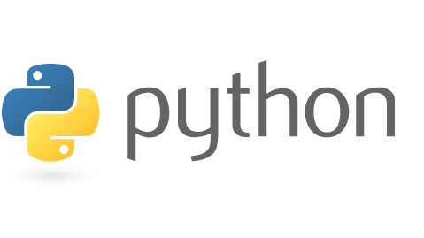
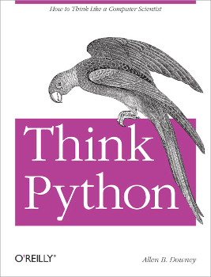

% Introduction to Programming
% Matthew X. Curinga

<!--
This syllabus was created for
the Educational Technology Program
at Adelphi University:
https://adelphi.edu
copyright 2012-2020 Matthew X. Curinga
http://matt.curinga.com
This work is licensed under the Creative Commons Attribution-ShareAlike 3.0 Unported License.
To view a copy of this license, visit http://creativecommons.org/licenses/by-sa/3.0/ or send
a letter to Creative Commons, 444 Castro Street, Suite 900, Mountain View, California, 94041, USA.
We ask, but do not require, that attribution includes a link to our websites (above).
version: 2.1
Based on work available here: https://github.com/mcuringa/adelphi-ed-tech-courses
-->

**Computer Science 0145-602-001, Fall 2022**

**Keywords:**  computer programming, CS1, python, computational thinking, critical computational literacy, jupyter, data science

**Description:** This course introduces students to programming and
core concepts of computer science, using a modern, object oriented
programming language (currently Python). Students learn concepts of
variables, functions, repetition/loops, basic data structures
(arrays, lists, dictionaries), and basic object oriented programming.

**Class meetings:** Online, asynchronous (coordinated through Moodle)

**Instructor**

* [Matthew X. Curinga](http://matt.curinga.com), <mcuringa@adelphi.edu>

**Dr. Curinga's Office Hours by appointment**

* Monday, 11-12PM
* Wednesday, 4:30-5:30PM
* Thursday, 4-5PM

Learning Goals
===========================

* understand the types of problems that can be solved using computational techniques
* understand the basic concepts of computation (CPU, RAM, permanent storage, GUIs, file systems, network connections)
* learn core computer programming concepts (abstraction, variables, conditions, functions, repetition, recursion)
* think algorithmically to design and test computer programs
* master the basic syntax and idioms of the Python programming language
* use technical documentation, APIs, and the internet to learn new technical concepts
* develop step-by-step problem solving and debugging practices

Required Software
=================
For this class we will be programming in the [Python](https://python.org) programming language,
using a development platform called [Jupyter Notebook](https://jupyter.org/).

You will be writing your code through a web-based version of Jupyter called
Jupyter Hub. Instructions for joining our Jupyter Hub are on the course website.

Required Text
=============
_Our textbook is free, open source, and available online. There are links
below to the "standard" version and an interactive version which includes
live code examples and comprehension questions. You may read either or both
or switch between them, depending on your preference._

Downey, A. B. (2016). [_Think Python: How to Think Like a Computer Scientist, Version 2.4.0_](http://greenteapress.com/thinkpython2/html/index.html). Green Tea Press.

Miller, B. &  Ranum, D. (n.d.) Based on work by Jeffrey Elkner, Allen B. Downey, and Chris Meyers. [_How to Think Like a Computer Scientist: Interactive Edition_](https://runestone.academy/ns/books/published/thinkcspy/index.html)

Reference Materials
===================
_Consult this documentation as needed._

- [[Jupyter Lab](https://jupyterlab.readthedocs.io/en/stable/user/interface.html)] <small>our software development environment</small>
- [[Python Documentation](https://www.python.org/doc/)] <small>official python language docs</small>
  - [[tutorial](https://docs.python.org/3/tutorial/index.html)] <small>basic tutorials</small>
  - [[library reference](https://docs.python.org/3/library/index.html)] <small>reference of the standard libraries</small>
  - [[style guide](https://peps.python.org/pep-0008/)] <small>naming variables, spaces, quotations, comments, etc.</small>

Class meetings
==============

This is a fully asynchronous online class, which will run on a Monday-Monday schedule,
meaning new topics will begin each Monday, and quizzes will be due by end
of day on Sunday. There are no set meeting times, and there will not be
Zoom or other video class sessions. You will be able to flexibly schedule your
time within the week for each topic.

### Weekly topics

Week  Date    Topic                        Read        Due
----  ------  ---------------------------- -----       -------------------
   1  Aug 29  The way of the program       TIP 1       Quiz 0
   2  Sep 05  Variables & Statements       TIP 2       Quiz 1
   3  Sep 12  Functions                    TIP 3       Quiz 2
   4  Sep 19  Conditionals & Recursion     TIP 5       Quiz 3
   5  Sep 23  Fruitful Functions           TIP 6       Quiz 4
   6  Oct 01  Function Review              -           Quiz 5
   7  Oct 10  Iteration                    TIP 7       Quiz 6
   8  Oct 17  Strings                      TIP 8       Quiz 7
   9  Oct 24  Lists                        TIP 10      Quiz 8
  10  Oct 31  Strings & Lists              -           Quiz 9
  11  Nov 07  Dictionaries                 TIP 11      Quiz 9
  12  Nov 14  Tuples & Files               TIP 12      Quiz 10  
  13  Nov 21  Content Analysis             -           -  
  14  Nov 28  Visualizing data             -           Project Thesis & Team
  15  Dec 05  Group Meeting                -           -
  16  Dec 12  Final Projects               -           **Final Project**

TIP: _Thinking in Python_

### Live labs

In addition to the required weekly assignments, there will be several "live"
labs on Wednesdays (4:30-5:30). These live **sessions are optional**,  but will
offer additional help and hands-on demonstration of course concepts.

### Tutoring

The Adelphi Learning Center offers [individual and group tutoring](https://www.adelphi.edu/learning-writing-centers/tutoring/),
which can be either in person or online, scheduled through their website. This is
an excellent, free service and you might want to schedule a session to go over some
of the labs. In addition, Math and Computer Science has free, drop-in tutoring sessions
on weekday afternoons in the Garden City campus. They may also post some
Zoom sessions. I will post the schedule and details on the course website after
the semester starts.

Assignments and Grading
=======================

Assignment          Pct
-------------       ----
Quizzes             60%
Final Project       40%

Lab Exercises
-------------
Most weeks there will be ungraded lab exercises where students can practice
the new materials covered. In general, you should spend about one hour working
on these exercises. If you understand the exercises, you will be on track with
the course. There may be bonus problems that are a little bit more
challenging, which are optional. You are encouraged to work on the exercises
with other students and friends. You are not asked to turn in lab assignments.

Quizzes
-------
Quizzes will consist of 1-3 questions, similar to the lab exercises. Each quiz
is worth a total of 6 points. Earlier in the semester, the quizzes will have
up to 6 questions each, with multiple choice and short answer questions. After
we develop more skills writing code, quizzes will consist of a single question
and you will copy-paste your solution or upload your source code to Moodle.

Quizzes will be timed, taken through Moodle. If you have already worked throug
the lab problems, quiz problems are designed to take approximately 30-40 minutes
to complete. You will have 90 minutes once you begin the quiz to submit your
answers. Before you attempt the quiz, make sure that you are ready to proceed --
you will not be able to pause the quiz once it begins. You can use the textbook,
course examples, and any documentation or internet resources you find. **You may
not ask other people for help.** While programming is a highly collaborative
practice, these quizzes are meant to assess _your_ work and understanding.

Final Project: Data Analysis
----------------------------

During the course of the semester we will be learning about the software design
process, and have the opportunity to write a larger program for this final project.
The final project is a group project, and you should work in a group of 2-4 students.

You will choose to do either a _content analysis_ project working with a corpus
of text data, _or_ a data analysis project working with quantitative data
from the New York City public schools open data set.

Content Analysis is a research approach that uses statistical methods to analyze
textual data. The skills we develop in this first semester of programming
will be enough to allow us to conduct our own, novel content analysis research.
We will be focusing on the analysis of textual data, with examples looking at
the content found in works of literature, song lyrics, and in political speeches.

Python is an excellent programming language for _data science_, and we will learn
some of the basic techniques of data science with python while looking at data
about New York City schools, including demographic information, State test scores,
regents scores, etc.

Your team will choose a single topic and coordinate (through sharing code on
our Jupyter Hub) on the final project. To submit this project you will turn
your finished Jupyter Notebook which includes both the code and the formatted
output. Each team member will upload a video screencast where they discuss
a key aspect of the code where they were the lead developer/designer.

### Final Project Grading:
1. **Concept & Design** (_5 points_)\
   Does the project demonstrate a good match between the type of question
   you explore and the type of answers that computer analysis can provide?

2. **Coding fundamentals** (_20 points_)\
   The program demonstrates a grasp of the programming concepts covered
   in this class, including:

    - _variables_
        - data is not "hard coded" and can be easily changed
        by using variables, soliciting user input, and/or reading from files
        - data is separate from functionality
    - _functions_
        - abstraction through function parameters
        - encapsulation through function parameters and return statements;
          use "pure functions" with zero-side effects when possible
        - composition and re-use of code
    - _design_
        - the program is organized through the use of functions
        - functions' "scale" is appropriate to the task and discrete:
          concerns are separated logically, such as one function
          for gathering results and another for outputting results
        - functions are written in a way that they are used
          several times in the program
        - code is not repeated
    - _data structures_
        - use python built-in data structures appropriately:
          `list`, `dict`, `tuple`, `set`, etc
        - use index/slice notation if needed
        - sort data structures
        - map, filter data as needed
    - _style_
        - is the code style consistent throughout the program?
        - does the code adhere to the style conventions discussed in our readings?
        - are variables and functions named in a clear way?
        - are comments and docstrings included to clarify the program?
    - _testing_
        - does the program include test functions to ensure the program is working as expected?

    Each team member will receive an individual grade for this portion of the project.

3. **Risk Taking** (_5 points_)\
   How "adventurous" is this project? Does the team show that they move beyond the
   template given to them? Do they come up with a really novel and desirable project?
   "Riskier" project push beyond the material strictly covered in class and demonstrate
   the teams' ability to learn new things and push their horizons.

4. **Results** (_10 points_)\
   How well does the program achieve its goals? Are the results clearly
   presented in the Notebook file?
