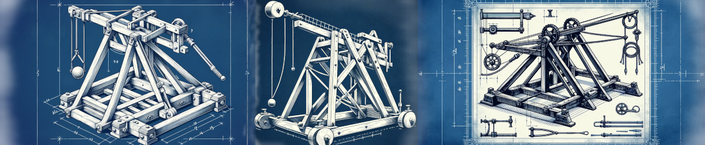

LEGO Robotics Catapult Lab
==========================

Overview
--------
In this lab students will work in teams to design a mechanical
catapult using LEGO Spike Prime robotics kits. The catapult must
be capable of launching a LEGO mini figure. Designs/builds will be evaluated
based on distance and accuracy, but other criteria will be specified
by the participants.

Time
----
90 minutes

Goals
-----
This lab is designed as a first introduction to building
and programming LEGO robotics. By the end of the lab,
students will be able to:

- build a LEGO robot
- program the touch sensor
- program the large motor
- evaluate a build for strength and stability
- implement an iterative design process

In addition to these technical skills, students will:

- identify ways that LEGO robotics can connect to other academic
  disciplines
- "re-enact" Constructionist activities to gain insight into this approach
- reflect on the role of play in learning
- reflect on the team dynamics in the design lab

Prior activities
----------------
Prior to the lab, the students are familiar with the goals
of the lab, and have been organized into teams of 3 or 4
students. They have read about maker and constructionist
education, and are familiar with the ways that LEGO robotics
have been used in classroom instruction.

Materials
---------
- LEGO Spike Prime robotics kits (1 kit per team)
- LEGO mini figure (1 per team)
- tape measure
- extra LEGO bricks / gears / axles / etc.

Procedure
---------
1. **Demo (10 min).** Instructor demonstrates a very basic catapult build and
   programs it to launch a ball. The goal is to show an
   overview of how the LEGO IDE works, and how to connect
   the brick to the computer. Link to the "code" so that teams
   can start with that as their base.
   **Teams are instructed to document their work with screen shots, photos, and video.**
2. **Build 1 (20 min).** Teams build a basic catapult. The instructor
   makes sure that each team can connect to their brick and knows
   how to start the program. With 5 minutes left, each team will demonstrate 
   their catapult. They will be given three launches per team. The instructor 
   measures the distance and records each teams score on a whiteboard or
   shared digital display. Teams are encouraged to divide their labor
   so that everyone is engaged. Possible divisions include:
   - team leader / project manager
   - researcher / designer
   - programmer
   - engineer / builder (2 people can share this role)
3. **Reflection (5 min).** The whole class discusses the project so far.
   They will discuss whether any additional materials are needed, codify
   any rules for the "competition" (does it have to be "catapult" or
   can a trebuchet, canon, or other construction be used?), 
   and decide on how launches should best be measured -- does accuracy
   matter? does the projectile need to clear a certain height?.\
   The instructor will provide feedback and suggestions on
   each build to the whole class (in the style of a studio critique or code review).
4. **Build 2 (40 min).** Teams build a second version of their catapult.
   They are encouraged to test often, and to divide work.
5. **Competition (15 min).** Teams will have three launches. The instructor
   will measure the distance (according to the rules devised by the students)
   and record the scores.

Resources
---------
- [LEGO Spike Prime](https://spike.legoeducation.com/prime/lobby/). Web based IDE.
- [LEGO Spike Prime User Guide]()