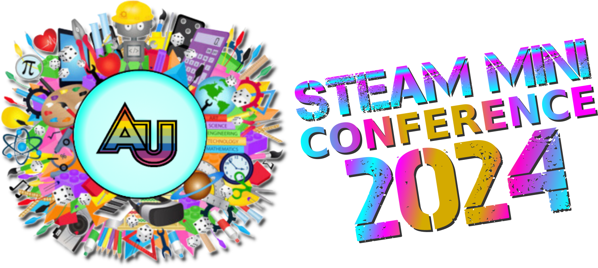

<i class="bi bi-award"></i> STEAM Mini Conference
====================================================

<i class="bi bi-calendar-heart-fill"></i> Tuesday, May 14 
4:30pm-9:00pm


### Details
* free and open to all
* **[registration required](https://forms.gle/Mee3oPQcxHgCuJht5)**
* **Location:**\
  [MIXI](https://mixi.nyc): Manhattan Institute for STEM & the Imagination\
  [Adelphi NYC @ St. Francis College, 7th floor](https://maps.app.goo.gl/WX3M68SeGC5THWLT7)




### Tentative schedule

- **4:30 - 5:00:** Registration / Set-up
- **5:00 - 5:15** Dr. Hogan's Welcome
- **5:15 - 6:00:** Workshop Session 1
- **6:05 - 7:05:** Science Board Game Play Sessions
- **7:15 - 8:00:** Workshop Session 2
- **8:00 - 9:00:** Reception


The <i>Second Annual MIXI STEAM Mini Conference</i> is a graduate student conference
that brings together our current students,
faculty, alumni, colleagues from other institutions, invited high school students,
and guests from the community. We will share and celebrate the work that we have
done this semester. Students from <b>Maker Lab 3</b> will present 45 minute workshops
highlighting original STEAM projects and activities they created. Students from
<b>Multimodal Literacies</b> will lead play-sessions to test out their STEM
board games for learning which they designed and prototyped.

{{ details | markdownify }}

{{ schedule | markdownify }}

Game Play Sessions
------------------
### 6:05 - 7:05pm





<h3><a href="template">{{game.title}}</a></h3>
<strong>{{game.names}}</strong>

{{game.description}}



Workshop Sessions
-----------------


### Transforming with Scratch
**Bianca & Merin**

[Scratch](https://scratch.mit.edu) is a free, online educational tool that can be used to introduce students to computer programming. Scratch allows users to code digital stories, games, and animations. In this workshop, we will explore various **geometric transformations** and design **algorithms** while simultaneously highlighting how this digital resource can seamlessly be implemented in a classroom setting. Participants of this workshop will be given a video game project framework that incorporates various geometric transformations. They will play the game, interact with its code, and then have the opportunity to construct their own levels where they will integrate geometric transformations into their own games. This workshop is designed for participants of all levels.

**Keywords:** Math, CS, Geometry, Scratch, Geometric Transformations, Algorithms, Game Design\
**Room:** TBD

### Visualizing Homeostasis with Chibitronics
**Katherine & Romulo**

**Homeostasis** is a key concept in biology (and one that can be difficult to visualize). This workshop will provide a hands on way of visualizing this concept while also allowing students’ creativity to shine. Workshop participants will use [Chibitronics](https://chibitronics.com/) to model positive and negative feedback in cells. Workshop participants will gain a basic understanding of Chibitronics and how they could be used to model reaction mechanisms in biological systems. They will use Chibitronics and paper circuits to design their own homeostasis model.

**Keywords:** Science, Biology, Homeostasis, Chibitronics, Positive and Negative Feedback, Paper Circuits\
**Room:** TBD

### Chaos Theory on a Canvas
**Michele & Rena**

**Chaos Theory** describes what is called a “sensitive dependence” on the initial conditions of a system. Meaning, the slightest change in variables within a chaotic system produces wildly unpredictable results with no discernible pattern compared to similar variables. It is paradoxically an unreplicable yet replicable system, since the same exact conditions within a system will always produce the same results. Through the use of **double pendulums** and watercolor paints, we will create unique works of art utilizing the concepts of Chaos Theory described above. Participants will choose the initial positions of double pendulums to paint on a canvas, then let them go, witnessing Chaos Theory in action, while guided through an in depth group lecture explaining the theory in concept, giving participants much needed context to their art pieces. 

**Keywords:** Physics, Chaos Theory, Double Pendulums, Painting\
**Room:** TBD





### Gesture Magic
**Nicole & Brian**

Participants will use breadboards, LEDs, and [micro:bits](https://microbit.org/) to learn how to make programs react to user "gestures" with a handheld device. Reading sensor information from the micro:bit **accelerometer**, participants can [code](https://makecode.microbit.org/) programs to react to different gestures and motions.

**Keywords:** CS, Accelerometers, micro:bit, gesture interfaces, MakeCode\
**Room:** TBD

### Musical Circuits
**Jacob & Saul**

We are teaching circuits! Participants will create cardboard instruments and connect them to [micro:bits](https://microbit.org/) in order to create music. In this workshop, participants will be given the task of creating an appropriate connection for the circuit to work. Students will be using alligator clips and aluminum foil as well as glue guns. Students will have the choice of creating a keyboard, guitar, or drum kit. We will give a brief introduction to music theory so students can customize their own melodies.

**Keywords:** CS, Music, Circuits, micro:bit, MakeCode\
**Room:** TBD

### Chibitronic Graduation Cards: Where Circuits Shine and Knowledge Spreads
**MaryRose**

Chibitronics offer experience with interactive components such as LED stickers, sensors, and circuits which are designed to easily be integrated into various projects allowing users to create interactive and illuminated designs by simply connecting them with conductive materials such as copper tape. Chibitronics provides a hands-on creative approach to learning circuits for students, blending craftiness with technology to provide an accessible and engaging entry point. Through designing and assembling illuminated graduation cards, participants will develop a deeper understanding of circuity concepts in a fun and non-intimidating way.

**Keywords:** Electronics, Chibitronics, Graduation Cards, Paper Circuits, LED Stickers\
**Room:** TBD

### “Make” a heart rate monitor! 
**Jessica & Shannen**

Jessican and Shannen will demonstrate their low-cost heart rate monitor built with micro:bit, 3D printed, parts, light sensors, and LEDs. Participants will learn to program the "monitor" to create biofeedback systems, and to study how their own pulse rate changes in response to different stimuli.

**Keywords:** Biology, Physics, micro:bit, Pulse Rate Sensor, Wearable Tech\
**Room:** TBD



<h3>Session 1</h3>
<h6 class="text-muted">5:15-6pm</h6>

{{ session_1 | markdownify }}

<h3>Session 2</h3>
<h6 class="text-muted">7:15-8pm</h6>

{{ session_2 | markdownify }}

