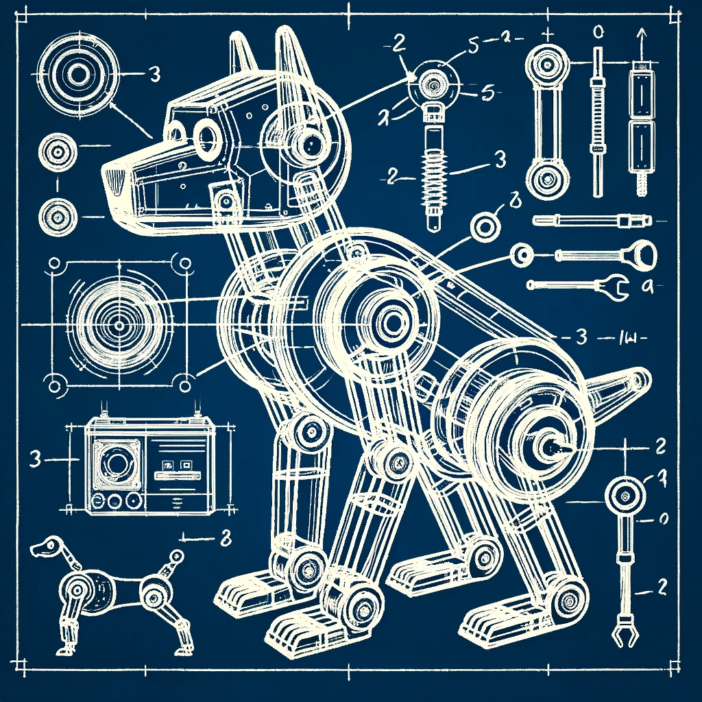

About the "School Lab"
=======================
**STEAM Teaching & Learning ESM 503, Spring 2024**

"School Lab" is the culminating course in the 3-course
maker lab sequence in the Master's of Arts in STEAM Teaching and Learning.
In this course students engage deeply with the promise, challenges, and
deficits of STEAM education and maker pedagogy. They have the opportunity
to dive deeply into a specific topic, to design their own public workshop
that demonstrates a their own original "maker" project and lesson
at the <a href="conference.html">MIXI STEAM Mini Conference</a>.

 
You can learn more about the course by checking out the [syllabus](syllabus.html).