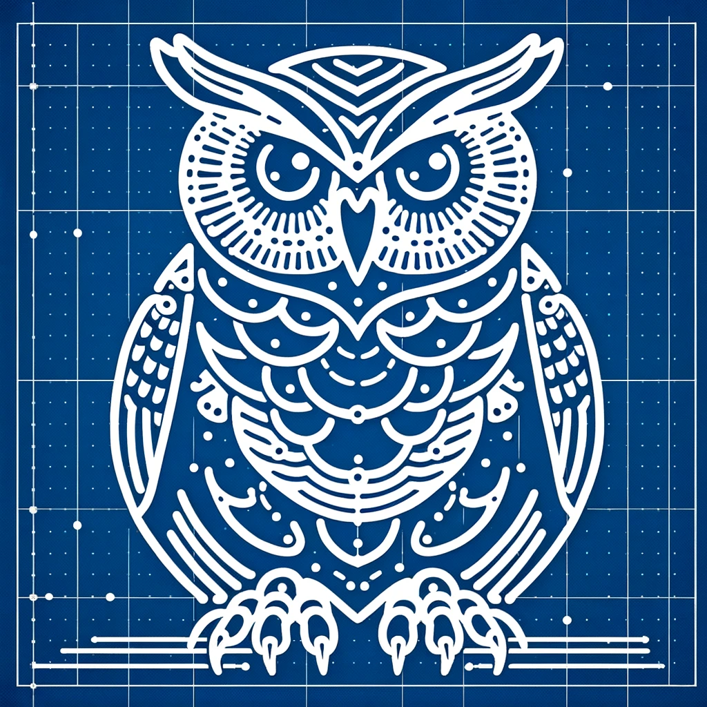

Labs
==========================

    

        
    

    

        <h3><a href="catapult-lab.html">Catapult Lab</a></h3>
        

            In this lab students will work in teams to design a mechanical
            catapult using LEGO Spike Prime robotics kits. The catapult must
            be capable of launching a LEGO mini figure. Designs/builds will be evaluated
            based on distance and accuracy, but other criteria will be specified
            by the participants.
        

    

    

        
    

    

        <h3><a href="rube-lab.html">LEGO Goldberg</a></h3>
        

            In this lab, students will extend a traditional "Rube Goldberg machine"
            by combining it with LEGO Robotics. The challenge extends
            engineering and programming skills, while explicitly asking students
            to focus on playfulness and creativity.
        

    

    

        
    

    

        <h3><a href="animal-lab.html">Fantasy Animal</a></h3>
        

            Teams design a "fantasy animal" that combines aspects
            of two or more "real" or mythical animals. They work
            through paper prototyping to eventually create a 
            laser-cut work.
        

    

