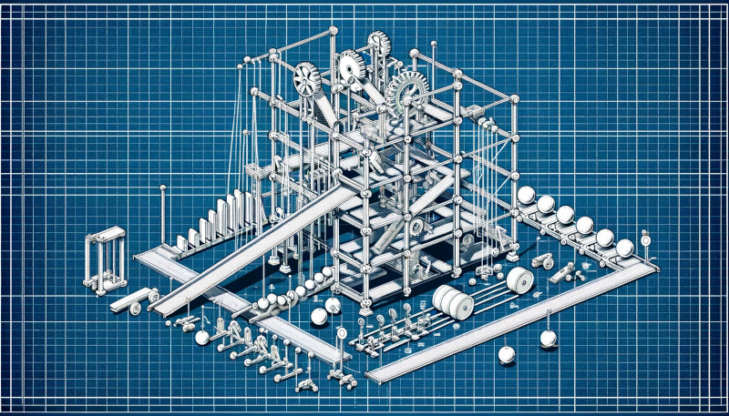

LEGO Robotics Catapult Lab
==========================

Overview
--------
"Rube Goldberg Machines" have been tried and true (maybe stale?)
hands-on projects in K-12 science classrooms; a way to teach
elements such as simple machines, design thinking, motion,
energy transfer, and more. In this lab, we will continue to
explore the potential of educational robotics by building
 a Rube Goldberg machine with LEGO robotics.

Time
----
90 minutes

Goals
-----
This lab is designed as a further exploration of
LEGO Robotics in the context of design, creativity,
play, and originality. Participants will:

- combine LEGO and non-LEGO materials to create a Rube Goldberg
  machine
- use at least 2 LEGO sensors and 2 LEGO motors
- program the large motor
- design a system that "works" but is also fun and novel
- implement an iterative design process

Prior activities
----------------

Materials
---------
- LEGO Spike Prime robotics kits (1 kit per team)
- matches, lighters, flint & steel
- extra LEGO bricks / gears / axles / etc.
- craft materials including:
  - marbles
  - dominoes
  - string
  - cardboard

Procedure
---------

Continuation
------------

Resources
---------
- [Cool Materials: Rube Goldberg](https://coolmaterial.com/feature/rube-goldberg-machines/).