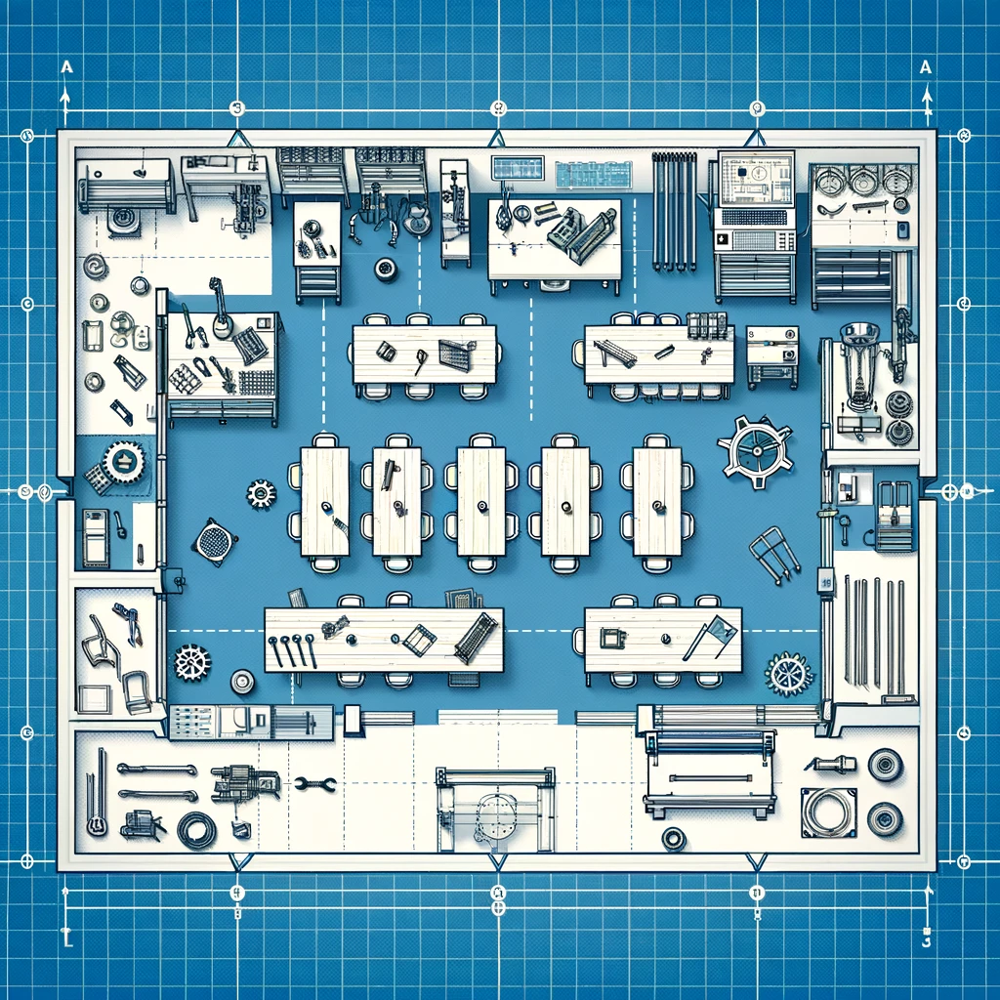
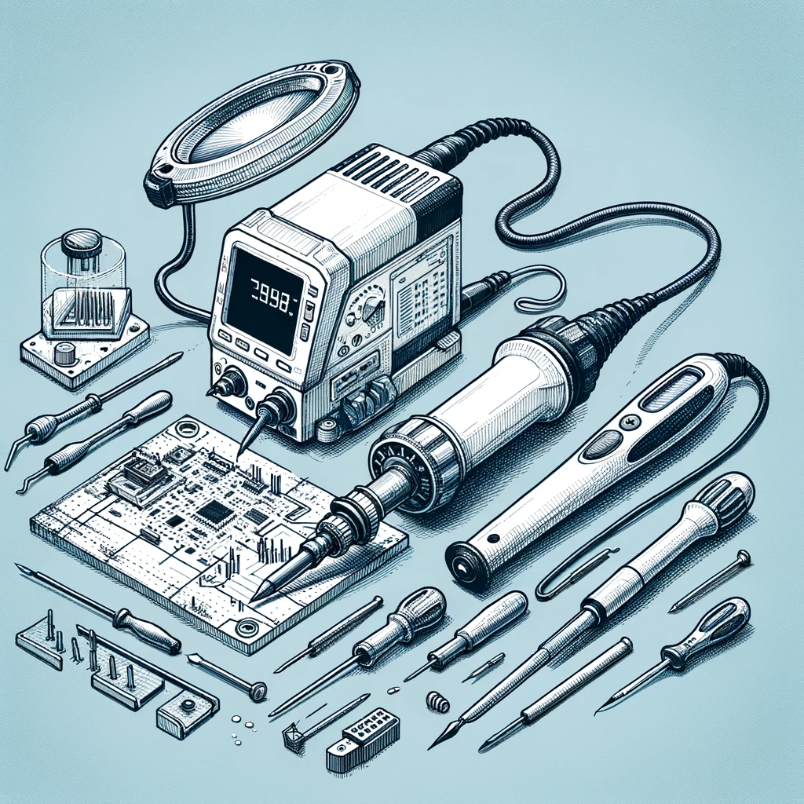
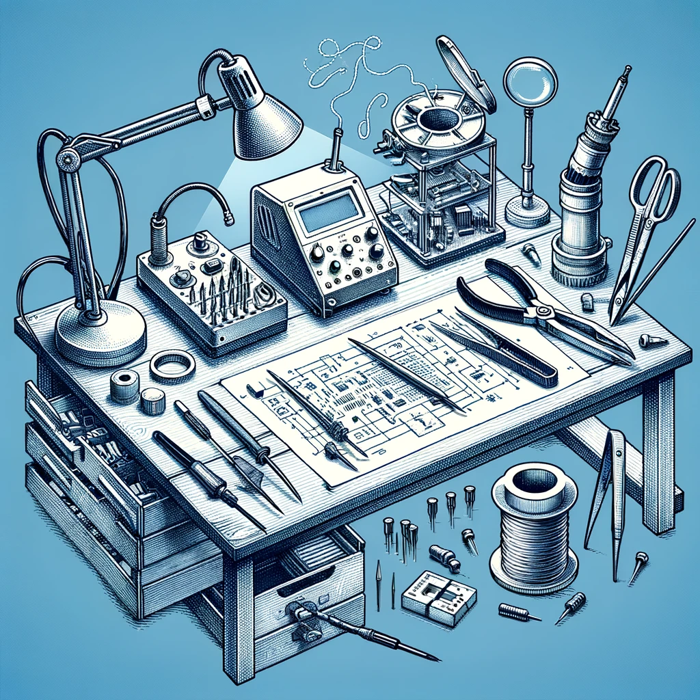

Maker Lab 3: School Lab
=======================
**STEAM Teaching & Learning ESM 503, Spring 2024**

**Key words:** STEAM, Maker Lab, Constructionism, 3D printing, laser cutting, LEGO robotics, microbit, arduino

Description
-----------

In the “school lab” students are challenged to conceive of and design their own STEAM 
workshop, which they co-teach for the public as a workshop at the MIXI lab during our 
Spring STEAM mini conference. To create their workshop, they will practice backwards 
design to develop and execute an effective lesson, including assessments of learning. 
Developing a specialized workshop allows students to solidify expert-level mastery of 
specific aspects of the maker lab; teaching these skills to an authentic audience helps 
them reflect on the knowledge they’ve acquired in the previous labs while practicing the 
lab-based pedagogical techniques which they’ve previously experienced as students. 
[prerequisite: labs 1 & 2]. 25 hours of fieldwork is required.

Course Goals
------------
The student will be able to:

- Define and identify characteristics of equitable classrooms where all learners have access to ensuring
  academic achievement.
- Analyze multiple frameworks used to support the development, implementation, and assessment of
  effective STEAM curricula.
- Identify and practice different models of co-teaching to support teaching and learning.
- Reflect and critique one own’s planning, instruction and assessment plans implemented for
  continual improvement to ensure an equitable and effective STEAM classroom.

Class Information
-----------------
**Instructor:**

- [Matthew X. Curinga](http://matt.curinga.com), <mcuringa@adelphi.edu>

**Class dates:** Tuesday January 23 - Tuesday May 15

**Office hours:**

- Tuesday 3pm-5pm, Brooklyn Campus
- _office hours by appointment_

Required Textbook
-----------------
_There is no required textbook for this course. Course readings will be made available through the course website._

Class Schedule
--------------

|Date    |Format       |Topic	                 | Due
|--------|-------------|-------------------------|---------------
|Jan 23  |online       |Roots of Maker Ed	     | 
|Jan 30  |in person    |LEGO Robotics 1	         | 
|Feb 06  |online       |Play and Creativity	     | 
|Feb 13  |in person    |LEGO Rube Goldberg	     | LEGO Portfolio Report
|Feb 20  |online       |Equity in the lab	     | 
|Feb 27  |in person    |Laser Cutter 1	         | 
|Mar 05  |online       |Assessing maker projects | 
|Mar 12  |in person    |Laser Cut Animals	     | Animal Portfolio Report
|Mar 19  |spring break |   	-	                 | 
|Mar 26  |in person    |Workshop Pitches	     | Workshop Pitch, self eval
|Apr 02  |online       |Workshop Pairs	         | 
|Apr 09  |in person    |Workshop Abstract        | 
|Apr 16  |online       |Workshop Lesson Plans    | Material List
|Apr 23  |online       |Studio                   | 
|Apr 30  |in person    |Studio	                 | 
|May 07  |in person    |Studio	                 | 
|May 14  |in person    |Mini Conference	         | Mini Conference Portfolio, self eval

This is a hybrid course with some in-person meetings and some online meetings. Mostly, we will
meet in-person every other week, but see the schedule above for details. Online weeks will be
oriented around completing course readings and working independently or in teams on assignments.
There will not be full-class online meetings on Tuesdays.
In-person classes will feature discussions of course readings, group working sessions, and
maker lab activities. Towards the end of the term we will focus on developing your STEAM
workshops.

Grading & Assignments
---------------------

|Assignment	                   |PCT
|------------------------------|----
|Participation & attendance 1  |15%    
|Participation & attendance 2  |10%    
|LEGO Portfolio Report         |10%    
|Animal Portfolio Report       |10%    
|Workshop Pitch                |10%    
|Mini Conference Workshop      |45%    

### Participation & attendance
One of the tenets of this class is that learning is more vibrant when we work on it together.
Collectively, we will work to develop new understandings of the potential and challenges
of maker education. In our labs, we will work to design and test new curricular projects.
_This cannot happen if you do not attend class, are not prepared, or arrive late._

You will be given two participation grades, and each time it will be the average
of the instructor's assessment and your self-assessment. The self-assessment is
straightforward, you will assign a numeric grade (0-15 for participation 1, 0-10 for participation 2)
and a brief statement explaining your criteria. Your criteria will not exactly match
my criteria, as we all value different aspects of learning. Here are the things I
am looking for:

- **Preparation:** You have completed the assigned readings and are ready to discuss them.
- **Respect:** You are actively engaged in the class discussion and activities, including
  listening to others and sharing your own ideas. In team projects, you respect deadlines
  and meeting times, and don't add to the stress and workload of your teammates.
- **Risk taking:** In some ways, deep learning is always uncomfortable. Full participation
  means you are willing to take risks and make mistakes. It also means that you go beyond
  the minimum requirements and shared materials to help us push boundaries together.

### Portfolio Reports
Everyone should have an online portfolio/website that they began in Maker Lab 1. You will
continue to use this portfolio to document your work in Maker Lab 3. Your portfolio reports
should have photos and videos of the projects you are working on, and written reflections
on the work. Although I will be observing your work directly, your grade for the 
LEGO lab, Animal lab, and Mini Conference presentation will be based on the record
you document with your portfolio.

### LEGO Lab
You will work with a team to design, test and build a LEGO "Rube Goldberg" machine.
The core of your design will be [LEGO Spike Prime](https://spike.legoeducation.com/prime/), 
but you can (and should) incorporate non-LEGO materials as well.

### Laser Cut Animal
You will work with a team to design, test and build a laser cut animal. You will
start with a cardboard/paper prototype working towards a final project that
is cut with the laser cutter. You will complete the project using traditional art
and craft materials (glue, paint, paint markers, etc). Your animal must have both
laser cuts and laser engraving.

### STEAM Workshop

The course culminates in a public mini-conference where you will lead
a 45 minute workshop with one teammate. The audience for the conference will
be STEM teachers (your peers and others like you), faculty, friends from
the doctoral program in education at Fordham University, and high school
students invited to attend.

Your goals for your workshop are:

- demonstrate a deep knowledge of one of the techniques of the maker lab and steam education
- design a workshop that addresses a hard pedagogical problem
- create a presentation that is thorough, engaging, and accessible to the audience

To document your work, you will create the following:

- workshop title
- workshop abstract / description
- a workshop lesson plan (that others can follow)
- a detailed material list, including any materials that need to be ordered
- a post-workshop reflection (including any photos an videos that document the work)

#### Workshop Pitch
Although this is a pair project, everyone will design their
own workshop pitch. The pitch will be a 5 minute presentation
where you share your idea for a great workshop. After hearing
and discussing all of the pitches, we will form teams of 2.