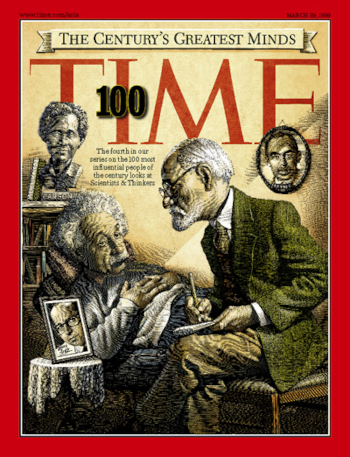

<i class="bi bi-router"></i> Week 1: Roots of Maker Ed
=======================================================
**Online, Jan 23 - Jan 29**

<figure class="figure float-end bg-light" style="max-width: 350px">
  
  <figcaption class="figure-caption fw-bold px-1">
    Jean Piaget featured in <i>Time</i> as a "greatest mind of the 20th century,"
    with an article by Seymour Papert.
  </figcaption>
</figure>

**Goals:** In this online week we will read some of the foundational work in STEAM and Maker education.
We will focus, specifically, on the theory of "Constructionism" developed largely by Seymour Papert
and his team at the MIT Artificial Intelligence Lab and later at the MIT Media Lab.

To do:
------
1. Read through the syllabus and course website
2. Complete the readings for this week.
3. Come to class with notes and questions to discuss.

Readings due:
-------------
- Papert, S. (1999, March 29). [Child Psychologist Jean Piaget](https://content.time.com/time/subscriber/article/0,33009,990617,00.html). _Time_.
- Papert, S. (1980). [The Gears of My Childhood (forward)](gears.html). _Mindstorms: Children, computers, and powerful ideas_. Basic Books, Inc.
- Papert, S. (1991). [Situating constructionism](https://web.media.mit.edu/~calla/web_comunidad/Reading-En/situating_constructionism.pdf). In I. Harel & S. Papert (Eds.), _Constructionism_ (pp. 1–10). Praeger.
