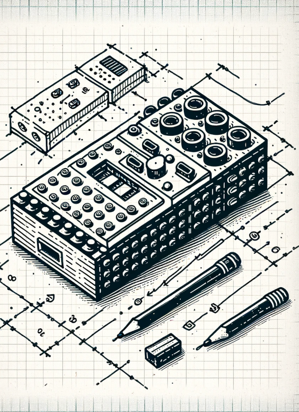

<i class="bi bi-building"></i> Week 2: LEGO Robotics
====================================================
**In-person, Jan 23 - Jan 29, 5pm-7pm**

**Goals:** We will learn how to program the latest generation of LEGO robotics. We will
pick up key engineering and programming techniques, practice our design skills, and consider
other academic applications of robotics.

Readings due:
-------------
**read before class**

- Papert, S. (1999, March 29). [Child Psychologist Jean Piaget](https://content.time.com/time/subscriber/article/0,33009,990617,00.html
). _Time_.
- Papert, S. (1980). [The Gears of My Childhood (forward)](gears.html). _Mindstorms: Children, computers, and powerful ideas_. Basic Books, Inc.
- Papert, S. (1991). [Situating constructionism](https://web.media.mit.edu/~calla/web_comunidad/Reading-En/situating_constructionism.pdf). In I. Harel & S. Papert (Eds.), _Constructionism_ (pp. 1–10). Praeger.

Background
----------
Papert's Constructionism research studied children learning the LOGO programming language.
To make the ideas of programming more concrete, Papert's team developed a physical turtle robot
that could be controlled through LOGO code. In the 1980s, this turtle evolved into the
"programmable brick" -- a computer built into a LEGO brick.

Agenda
------
1. Welcome
2. Discuss readings
3. LEGO Robotics lab

Resources
---------
- [LEGO Spike Prime](https://spike.legoeducation.com/prime/lobby/). Web based IDE.

Readings Out
------------
- Zhong, B., & Xia, L. (2020). [A Systematic Review on Exploring the Potential of Educational Robotics in Mathematics Education](https://www.researchgate.net/profile/Baichang-Zhong/publication/328999525_A_Systematic_Review_on_Exploring_the_Potential_of_Educational_Robotics_in_Mathematics_Education/links/5ee1747a458515814a544210/A-Systematic-Review-on-Exploring-the-Potential-of-Educational-Robotics-in-Mathematics-Education.pdf). _International Journal of Science & Mathematics Education_, _18_(1), 79–101.

