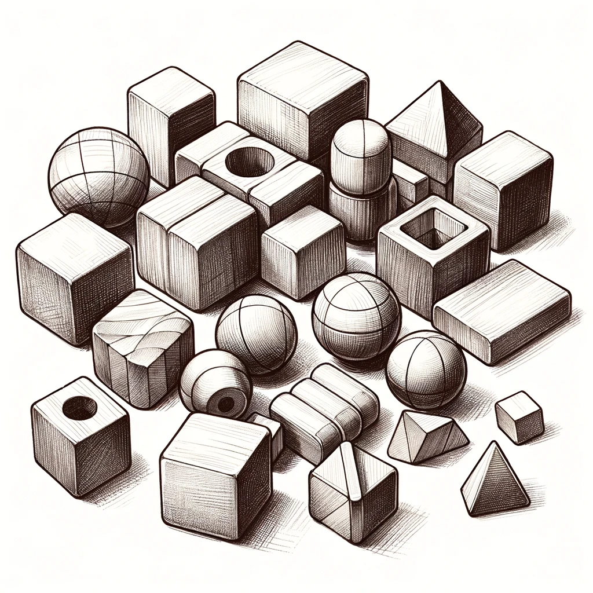

<i class="bi bi-router"></i> Week 3: Play and Creativity
========================================================
**Online**

**Goals:** This week we will read about play and creativity. Consider how we can design and organize
learning environments to support our own definitions of play and creativity.

Readings this week:
-------------------
- Papert, S. (2002). [Hard Fun](hard-fun.html).
- Runco, M. A., & Jaeger, G. J. (2012). [The Standard Definition of Creativity](http://emotrab.ufba.br/wp-content/uploads/2019/06/RUNCO-Mark-The-Standard-Definition-of-Creativity.pdf). _Creativity Research Journal_, _24_(1), 92–96.
- Culpepper, M. K., & Gauntlett, D. (2020). [Making and learning together: Where the makerspace mindset meets platforms for creativity](https://journals.sagepub.com/doi/full/10.1177/2043610620941868). _Global Studies of Childhood_, _10_(3), 264–274.
- Zhong, B., & Xia, L. (2020). [A Systematic Review on Exploring the Potential of Educational Robotics in Mathematics Education](https://www.researchgate.net/profile/Baichang-Zhong/publication/328999525_A_Systematic_Review_on_Exploring_the_Potential_of_Educational_Robotics_in_Mathematics_Education/links/5ee1747a458515814a544210/A-Systematic-Review-on-Exploring-the-Potential-of-Educational-Robotics-in-Mathematics-Education.pdf). _International Journal of Science & Mathematics Education_, _18_(1), 79–101.

Do this week:
-------------
- Do the readings (see above)
- Meet with your team and work on the Rube Goldberg lab
- Bring designs/sketches to next week's class