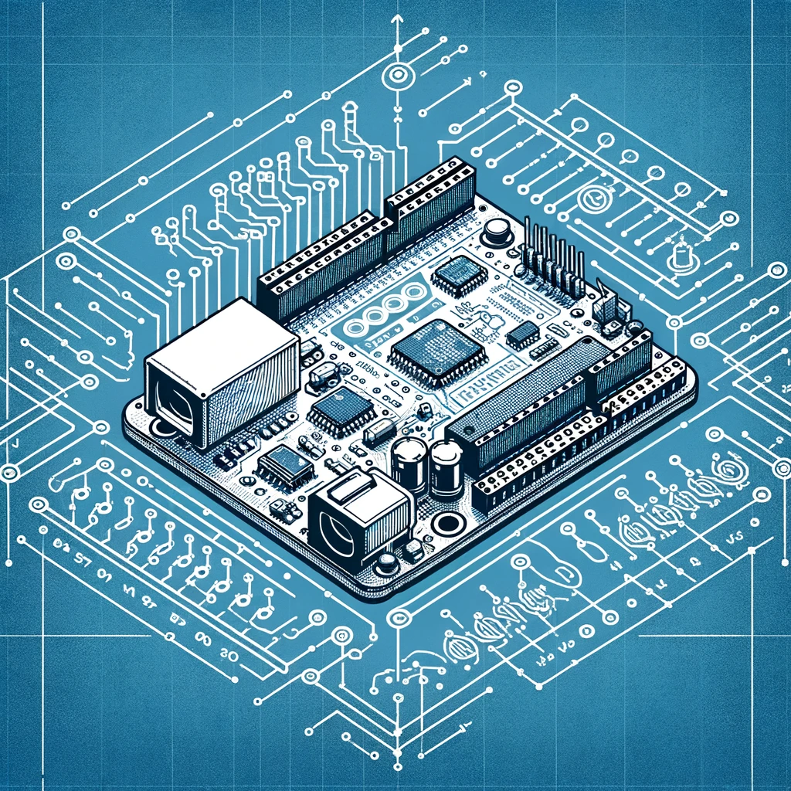

<i class="bi bi-router"></i> Week 5: Robotics and Computational Thinking
========================================================================
**Online**

**Goals:** Understand the ways that computing and thinking about computing cut across STEM and non-STEM fields. Consider ways to teach computing in the context of other disciplines.

Readings this week:
-------------------
- Papert, S. (2002). [Hard Fun](hard-fun.html).
- Runco, M. A., & Jaeger, G. J. (2012). [The Standard Definition of Creativity](http://emotrab.ufba.br/wp-content/uploads/2019/06/RUNCO-Mark-The-Standard-Definition-of-Creativity.pdf). _Creativity Research Journal_, _24_(1), 92–96.
- Culpepper, M. K., & Gauntlett, D. (2020). [Making and learning together: Where the makerspace mindset meets platforms for creativity](https://journals.sagepub.com/doi/full/10.1177/2043610620941868). _Global Studies of Childhood_, _10_(3), 264–274.

Do this week:
-------------
- Do the readings (see above)
- Finish (and record) Rube Goldberg lab
- Submit your Rube Goldberg portfolio for grading
