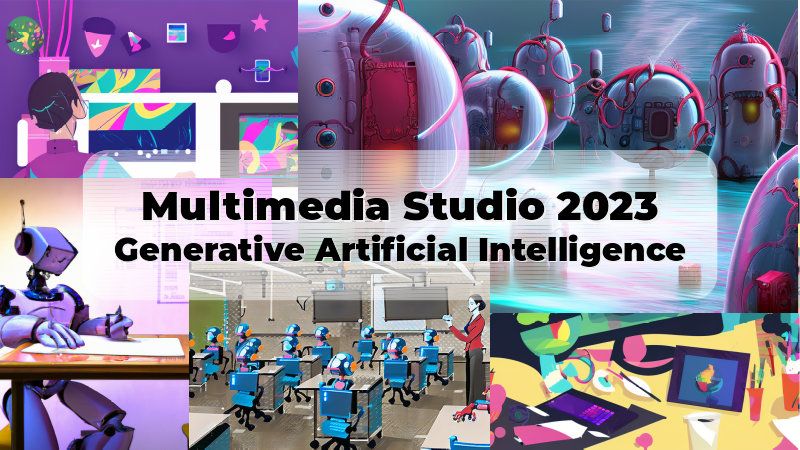
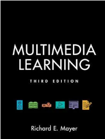
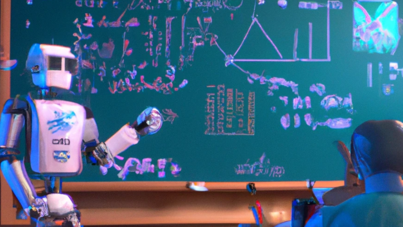

<!--
This syllabus was created for
the Educational Technology Program
at Adelphi University:
http://education.adelphi.edu
copyright 2012-2021 Matthew X. Curinga
http://matt.curinga.com
This work is licensed under the Creative Commons Attribution-ShareAlike 3.0 Unported License.
To view a copy of this license, visit http://creativecommons.org/licenses/by-sa/3.0/ or send
a letter to Creative Commons, 444 Castro Street, Suite 900, Mountain View, California, 94041, USA.
We ask, but do not require, that attribution includes a link to our websites (above).
version: 2.1
Based on work available here: https://github.com/mcuringa/adelphi-ed-tech-courses
-->

Educator's multimedia studio
============================
**Educational Technology 0858-620, Spring 2023**

**Keywords:** studio pedagogy, interaction design, multimedia
learning, digital studio, ed tech capstone, instructional design,
school segregation, urban education, urban technology

**Description:** How can digital media best support learning?
Working on semester-long projects, students learn about interaction
and instructional design. In this hands-on studio, develop and
extend skills in multimedia authoring: digital images/audio/video,
and interactive web development. Apply these skills to create a
original educational resources.

**Class meetings:**

This asynchronous online class will be run on a Thursday-Wednesday schedule, with new weekly assignments beginning on Thursday morning with completion dates by end of day Wednesday. In addition to the Moodle course website, we will use Slack as a **required** tool for this course with many of the class discussions taking place on Slack. If you are not a member of our Slack yet, you can find the invitation on the course website.

**Instructor:** [Matthew X. Curinga](https://matt.curinga.com), <mcuringa@adelphi.edu>

**Office hours: (online)**

- Monday 3-5pm
- Wednesday 2:30-4:30pm
- _office hours by appointment_

------------------------------------------------------------------------

## What is a multimedia studio?

Each semester the multimedia studio features a different challenge, dealing with an important, global topic. Students will be asked to work on a semester long multimedia project that teaches some aspect of this challenge.

The Spring 2023 Studio theme is **generative artificial intelligence**. Generative AI refers to using computers to generate new work. Current examples include computer generated images, video, news headlines, fiction, essays, computer code, and much more. Our goal, in the studio, will be to create multimedia learning materials that help us (as a society) to better understand the technology behind this type of AI and to explore the social, ethical, poltical, and economic implications of this new tech.

## Goals
This course is designed to challenge students to develop their abilities as instructional designers and as authors and producers of digital media for learning. Specifically, they should learn to:

-   design an effective digital learning environment that is intuitive
    to use and follows principles of Universal Design for Learning
-   develop in-depth skill in one area of digital production: video
    editing, graphic design, game design, computer programming, web
    design, etc.
-   understand key concepts of instructional design, including meeting
    the needs of the target audience, assessing learning outcomes,
    and following sound and ethical pedagogical principles
-   think creatively about far-reaching challenges in teaching and
    learning

At the end of the studio, every student will have a high quality, published multimedia artifact that will be part of their portfolio.

## Required texts


Mayer, R. E. (2020). _Multimedia Learning (3rd edition)._ Cambridge University Press. 
Buy: [[Indiebound](https://www.indiebound.org/book/9781316638088)] [[Barnes & Noble](https://www.barnesandnoble.com/w/multimedia-learning-richard-e-mayer/1116943046?ean=9781316638088)] [[Amazon](https://www.amazon.com/Multimedia-Learning-Richard-Mayer-ebook/dp/B088SZNG7B/)]

{{ md | markdownify }}

_Other readings provided through course website._

## Class meetings

|week  |date    |topic                                | 
|----  |------  |-------------------------------------|
| 1    |Jan 26  |Generative AI & Science of Learning  |
| 2    |Feb 02  |Multimedia Principle                 |
| 3    |Feb 09  |Multimedia Group 1                   |
| 4    |Feb 16  |Multimedia Group 2                   |
| 5    |Feb 23  |Multimedia Group 3                   |
| 6    |Mar 02  |Multimedia Group 4                   |
| 7    |Mar 09  |Topic Briefing (1 & 2)               |
| -    |Mar 16  |Spring Break                         |
| 8    |Mar 23  |Topic Briefing (3 & 4)               |
| 9    |Mar 30  |Pitches                              |
|10    |Apr 06  |Studio: photos & illustrations       |
|11    |Apr 13  |Studio: video & audio editing        |
|12    |Apr 20  |Studio: data viz                     |
|13    |Apr 27  |Studio: web publishing               |
|14    |May 04  |Critique                             |
|15    |May 11  |Studio Session                       |
|16    |May 18  |Final Show (live zoom)               |

<figure>

<figcaption class="bg-dark text-white p-1">This image was created by [DALL-E 2](https://openai.com/dall-e-2/) using the prompt: `a human teacher in front of a classroom with robot student seated at a desk. the teacher faces the class. the perspective is from the back of the room. the teacher is teaching algorithms with a graph diagram on a whiteboard. 4k, detailed, vivid colors, digital art`</figcaption>
</figure>

Assignments
--------------------------------------------------------------------------------
### Grading

|Assignment       |% of final grade|
|-----------------|----------------|
|self-evaluation  |10%             |
|multimedia group |15%             |
|topic briefing   |15%             |
|pitch            |10%             |
|critique         |20%             |
|final project    |30%             |

### Self-evaluation
Everyone will complete 2 self-evaluations during the semester. This online studio
is a collective effort, so when you fail to participate, you are not only affecting
your own learning. Your self-evaluation should consider your contribution to group
projects, completing readings on time, effort into your assignment, and participation
in discussions and other online activities.

### Multimedia group presentation

Working with your assigned group, you will create a multimedia slideshow that demonstrates the key multimedia cognition concepts assigned to your group from _Multimedia Plearning_. The total presentation must be between 10-15 minutes long. You are only required to read the sections for the week you are presenting, but everyone should read the section/chapter headings and is encouraged to read the chapters. Your presentation **must** follow all of the principles in your and all preceding sections. Groups must also include some germaine examples of multimedia (created by other people) that either make good use of the principles discussed or deviate from the principles. You will submit the link to your video on the `#generative-ai` slack channel and comments/discussion will be posted as a thread in responst to your post.

### Topic briefing
The "briefing" sessions will help us develop our domain knowledge of generative AI. You will choose a specific topic of your choice related to generative AI and then create a 3-minute briefing report -- a narrated slide show on your topic. We will watch your presentation in class and then have time for some follow up questions regarding your topic. In addition to your slideshow, you will also post the bibliography used to create your briefing. You should have at least 3 sources, one of them being an academic source. The specific topic of your briefing will probably relate to the aspect of generative AI that you will highlight in your multimedia project.

Multimedia project
------------------
The culminating work for this class is your _multimedia project_. Everyone must
work on their own individual project. They will produce a multimedia work that
demonstrates their skills as a designer and producer of multimedia, their
knowledge of the studio topic, and their understanding of the learning sciences
of multimedia.

You should begin thinking about your project during the first week of class. Consider:

- what types of multimedia do you find the most interesting and engaging?
- what are your strengths?
- what would you like to learn more about?
- what skills and demos would you like to highlight as a professional educational technologist?

Past Studio projects include:

- instructional videos
- documentary videos
- animations
- data visualizations
- infographics
- (analog) learning games / card games
- video games
- e-learning courses (captivate, edx, canvas, google classroom, moodle)
- self-paced online courses
- simulations
- interactive websites
- mobile/location based learning systems
- interactive stories (Twine)
- multimedia textbooks
- map/spatial multimedia

### Pitch

You will formally pitch your idea for your your final project. The purpose of
the pitch is to propose your project in a way that makes it sound exciting,
worthwhile, and feasible. You want to tell a good story about what you plan to
develop. You should also have some sketches, mockups, sample art, etc. that may
be required to make your point.

Plan for a 5 minute presentation.

### Critique
You will formally present a working prototype of your project to get feedback
from the instructor and your peers. You should have a solid plan for completing
the project.

**Critique and Final Evaluation Criteria**
_Refer to these criteria for the evaluation of your multimedia project._

#### Originality & innovation
Does the project take a novel approach to teaching with digital media? Does
it combine existing practices in new ways, for a new effect? Does it
address an important topic, or hard to teach concept that is relevant
to the topic of the studio? In other words, how _important_ is the learning
goal for the project?

Students will lose points in originality for verbatim translating of
existing learning solutions to the new problem space.

#### Design
The design of the project encompasses the information, interaction, and
visual design. Points to consider when evaluating the design:

-   is the navigation consistent, logical, and easily understood?
-   does the graphic design engage users?
-   does the look and feel support the learning goals of the project?
-   does the user interface take advantage of existing conventions, UI
    widgets, and user patterns?
-   are there clear paths through the system to accomplish user goals?
-   are system messages and instructions consistent and clear?
-   does the overall design exhibit a level of professionalism and
    polish that supports trust by the user?
-   is the design accessible?
    -   does it support the widest possible range of computer systems
        (including OS, web browser, screen size/mobile, processor speed,
        internet connection quality)
    -   can it be accessed by users with disabilities, where
        appropriate?

#### Technique
The project's technique reflects the proficiency of the producer with the
tools of the digital studio. All aspects of the project should be well
tested for smooth operation. Users should not easily "break" the system.
The specifics of development depend on the media. So, each of the
various skills required for the course will be evaluated based on the
practice of expert practitioners.

-   is video composed and edited like an expert video?
-   does software meet the speed and reliability that an expert would
    expect?
-   etc.

#### Learning science
At the end, this studio challenge is about learning. Points in this
category are awarded for exhibiting a thorough understanding of how
people learn with digital artifacts. Successful projects will account
for the cognitive, social, pragmatic, ethical, and aesthetic
implications of their design, as it impacts learning.

- - - -

Previous Studios
----------------
- [Spring 2022: School Segregation](segregation-studio.html)
- [Spring 2021: Smart Cities](smart-city-studio.html)
- [Spring 2017: Info Sec](hacker-studio.html)