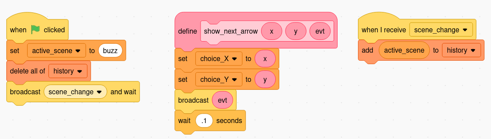
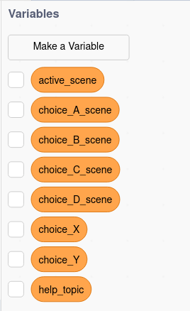
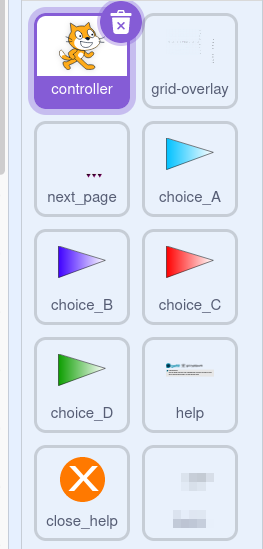
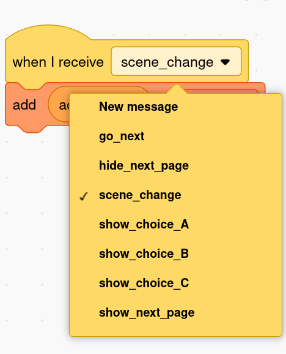
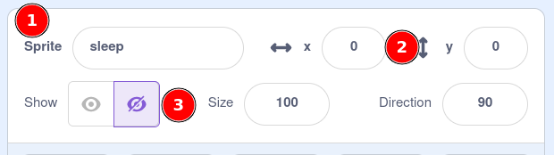
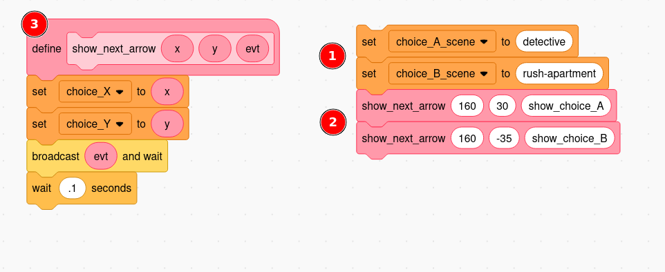
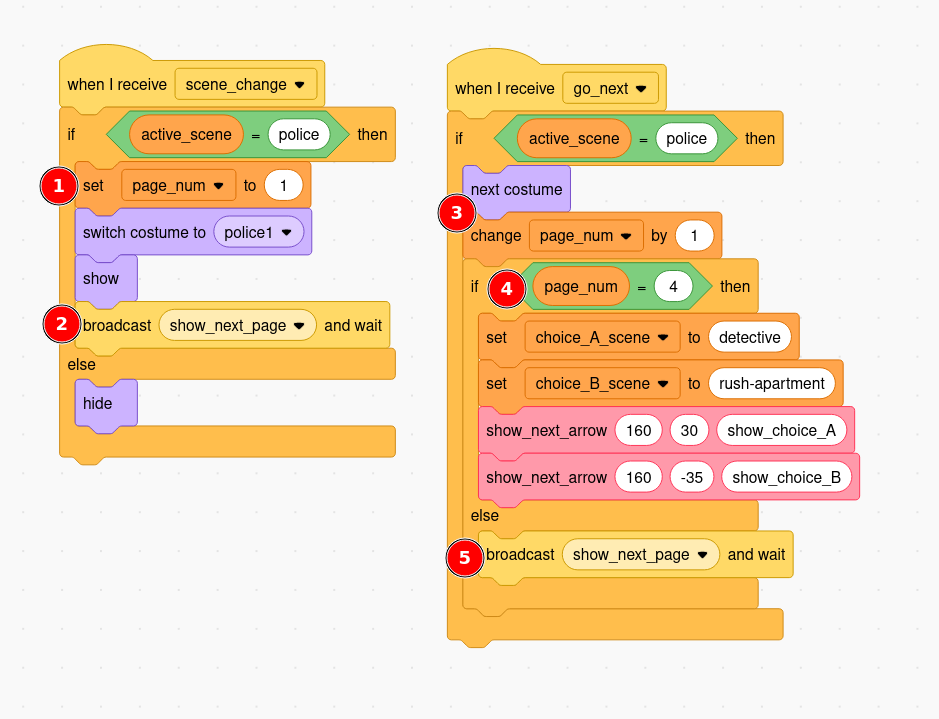

MIXI Story Game System
======================

The MIXI Story Game System is a Scratch platform/starter template to make
it easier to create interactive fiction, visual novels, and other story games.

Key Concepts
------------
The game is organized into **scenes** represented by Scratch sprites.
**Pages** written as SVG in Scratch costumes, and **events** which
communicate changes between scenes.

A central **controller** sprite manages the game state such as
the history of visited scenes, and initial starting state.
It can be modified to include features such as score, inventory,
health/life, or other game state.

A number of "standard" sprites are part of the platform, which
make include a "next page" button, and four "choice" buttons [A, B, C, D].

Variables
---------
Global variables, shared across sprites, keep track of the game state and
allow communication (working with events) between sprites. The following
variables are part of the core system:

    


- `active_scene` - the name of the current scene
- `choice_A_scene` - switch to this scene if the choice A button is clicked
- `choice_B_scene` - switch to this scene if the choice B button is clicked
- `choice_C_scene` - switch to this scene if the choice C button is clicked
- `choice_D_scene` - switch to this scene if the choice D button is clicked
- `choice_X` - the `x` coordinate to position the next button displayed
- `choice_Y` - the `y` coordinate to position the next button displayed
- `help_topic` - the name of the help page to display _if_ the help scene is shown
- `history` - a list of visited scenes, useful for back buttons, breadcrumbs, 
   and to see if a scene has been visited

{{ md | markdownify }}

Game Sprites
------------
Game sprites are spites that are not scenes, typically they are buttons or
other interactive elements that can be re-used across scenes. These
helper sprites hide themselves on scene changes and wait for "show"
events to make themselves visible again.

    


- `controller` - manages the game state and events
- `grid-overlay` - a sprite to help position elements on the stage (not used in-game)
- `next_page` - a button to move to the next page within a scene
- `choice_A` - the button to select choice A
- `choice_B` - the button to select choice B
- `choice_C` - the button to select choice C
- `choice_D` - the button to select choice D
- `help` - a special scene that can contain help pages (help is not recorded in `history`)
- `close_help` - a button to close the help page and go to the previous scene

** Note: _"Buttons" are named with underscores to distinguish them from scenes._



{{ md | markdownify }}

Events
------------
Game sprites are spites that are not scenes, typically they are buttons or
other interactive elements that can be re-used across scenes.

    


- `go_next` - triggers/listens for the next page event;
   broadcast by the click-event on the `next_page` sprite
- `show_next_page` - mark the `next_page` sprite as visible
- `hide_next_page` - mark the `next_page` sprite as hidden
- `show_choice_A` - mark the `choice_A` sprite as visible
- `show_choice_B` - mark the `choice_B` sprite as visible
- `show_choice_C` - mark the `choice_C` sprite as visible
- `show_choice_D` - mark the `choice_D` sprite as visible

** Note: _"Buttons" are named with underscores to distinguish them from scenes._



{{ md | markdownify }}

Function(s)
-----------
Currently, there is only one helper function in the system.

`show_next_arrow`\
This function is used to show a next scene button (`choice_A`, `choice_B`, `choice_C`, `choice_D`).
When it is called, it sets global variables to position the button, and then
uses a function parameter to determine _which_ button should reveal itself.

Parameters:

- `x` - the `x` coordinate to position the next button displayed
- `y` - the `y` coordinate to position the next button displayed
- `evt` - the name of the button event to broadcast, choices are 
   [`show_choice_A`, `show_choice_B`, `show_choice_C`, `show_choice_D`]

Functions in Scratch can only belong to a single sprite, so this function
must be duplicated with a sprite, or it can be copied from the
controller using Scratch's "backpack" feature. The code and usage for
this function are shown below in the "changing scenes" recipe.

Recipes
-------
### Creating a new scene

① 	② 	③ 	④ 	⑤ 	⑥ 	⑦ 	⑧ 	⑨ 	⑩

Scenes can be created from scratch by creating a new sprite or (more easily)
by duplicating an existing scene sprite. Things to keep in mind when creating
a new scene

**Name the sprite** with a short, descriptive name for the scene. The example
story users all lowercase names with hyphens to separate words. "scene-1"
is not a good name -- the name should describe the scene. "forest-clearing"
is a better name, for example.

**Set `x` and `y` to zero**. When duplicating sprites, they may be offset from
the center. Make sure that the sprite is at the center of the stage. This
will make it easer to line up your text and other elements. Your probably want
to hide it, too.

<figure>
  
  <figcaption class="text-italic">
  <b>①</b> this scene is named `sleep`; 
  <b>②</b> `x` and `y` are set to zero; 
  <b>③</b> the sprite is hidden by default.
  </figcaption>
</figure>

**Hide the scene on start.** Add an "on start" block that hides the scence.
The controller will signal when the first scene should be shown.

**Add a `scene_change` listener** that listens for the `scene_change` message.
`scence_change` is the core event that lets the system know when to switch
scenes. When receiving this event, the sprite shows itself if its name
matches the `active_scene` global variable, otherwise it hides itself
because it's inactive. This is the place to add transition effects,
background music, sound effects, and other elements that signal a scene
change.

**Add a `go_next` listener** that listens for the `go_next` message.
Like the `scene_change` event, this block should check to see if 
it's the active scene, and then advance to the next page. This is only
necessary for scenes that have multiple pages of text/story.

### Changing scenes

<figure>
  
  <figcaption class="text-italic">
  <b>①</b> set variables to tell which scenes are activated by the choices; 
  <b>②</b> call the `show_next_arrow` to position and activate the buttons; 
  <b>③</b> the function definition for `show_next_arrow` (you don't have to change this).
  </figcaption>
</figure>

The code snippet above shows how to add to choices to a scene (A and B). The
four statements labeled ① and ② should happen in the `scence_change` event
listener if there is only one page or the choices are active throughout
the scene. If the choices only appear on a _specific_ page of the scene,
those statements must get executed in the `go_next` event listener.

### Iterating through pages
It is a common pattern for a scene to have several story pages which
culminate in a page with choices. This is coded in the `go_next` event
listener. This recipe declares a **local variable** (a variable
only visible to the sprite) called `page_num` which keeps track
of the current page. The `next_page` arrow is displayed on each
page except for the last page (determined by an `if` block
which checks `page_num`).

<figure>
  
  <figcaption class="text-italic">
  <b>①</b> reset `page_num` to 1 when this scene loads; 
  <b>②</b> show `next_page` button at the bottom of the first page; 
  <b>③</b> when `go_next` is triggered, advance to to the next costume (i.e. page)
  and increment (add one to) `page_num`; 
  <b>④</b> if `page_num` is equal to the last page (4 in this case), then
  show the choices to choose the next scene; 
  <b>⑤</b> if `page_num` is not the last page, then show the `next_page` button.
  </figcaption>
</figure>