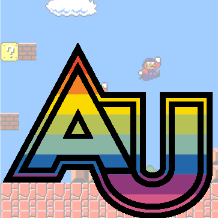

<!-- **********************
    * This syllabus was created for
    * the Educational Technology Program
    * at Adelphi University:
    * http://education.adelphi.edu
    * copyright 2010-2021 Matthew X. Curinga and Aaron Chia-Yuan Hung
    * https://matt.curinga.com
    * https://www.hungchiayuan.com/
    * This work is licensed under the Creative Commons Attribution-ShareAlike 3.0 Unported License.
    * To view a copy of this license, visit http://creativecommons.org/licenses/by-sa/3.0/ or send
    * a letter to Creative Commons, 444 Castro Street, Suite 900, Mountain View, California, 94041, USA.
    * We ask, but do not require, that attribution includes a link to our websites (above).
    * version: 2.1
    */-->


Learning with games
===================
**Educational Technology 0858-611**\
**Adelphi University, Fall 2024**

**Keywords:** games for learning, game design, serious games, simulations, multimedia learning, virtual reality, augmented reality




**Instructor:** [Matthew X. Curinga](http://matt.curinga.com "prof curinga's site"), <mcuringa@adelphi.edu>

**Campus:** Online\
**Meeting time:** asynchronous








Description
-----------
Video games have become an increasingly important source of culture and entertainment in our society. They are more popular than Hollywood movies, yet receive a fraction of the attention, especially in academia. In recent years, this has been changing, as scholars have begun to interrogate games from many levels: design, critique, and as a means of learning. In this course, we really have 3 separate, but overlapping goals: 1) to understand video games as a social and cultural phenomenon, especially important to youth culture; 2) to think of ways to teach _about_ video games, as part of a (digital) literacy perspective; and 3) to investigate ways to teach _with_ games, both off the shelf and ones that we design ourselves.




Goals
------
The course has two main goals. Firstly, it introduces students to a range of game genres that have been popular in education. Secondly, it covers a range of learning principles, research topics, controversies, and potential applications for video games and simulations in education, and gives students the foundations for applying both analog and digital games in educational contexts.

By the end of the course, students should be able to:

- Understand major topics in educational games and simulations
- Situate video games and learning in its historical manifestations - military exercises, simulations, game theory, board games and digital (video) games
- Understand the difference between exogenous and endogenous games, and design a simple endogenous game that can be used to teach a specific topic
- Understand the key differences between popular game genres
- Analyze and reflect on the potential of existing games and their potential in educational contexts





Materials
---------
### Books
_There are no required books to purchase for this class_. 
All readings and videos are available through the course website.
Weekly readings will be posted on the course website.

### Games
We will be playing several games during the semester, including some commercial
video games that will have to be purchased. Total cost for games will be
less than $100.



Class sessions
--------------

|Session|Date    |Topic                       |
|-------|--------|----------------------------|
|      1|Aug 29  |Welcome                     |
|      2|Sep 05  |Playing & Learning          |
|      3|Sep 12  |Game Mechanics              |
|      4|Sep 19  |Narrative                   |
|      5|Sep 26  |Game Design                 |
|      6|Oct 03  |Game Violence               |
|      7|Oct 10  |Games & Representation      |
|      8|Oct 17  |Games for Learning          |
|      9|Oct 24  |Educational Games           |
|     10|Oct 31  |Designing as Learning       |
|     11|Nov 07  |Game Pitches                |
|     12|Nov 14  |Design studio               |
|     13|Nov 21  |Paper testing               |
|      -|Nov 28  |_Thanksgiving Break_        |
|     14|Dec 05  |Game testing                |
|     15|Dec 12  |Final Games                 |




Assignments & Grading
---------------------

|assignment           |due    |pts  |
|------------------   |-------|-----|
|Online Participation |weekly |30   |
|Game study post 1    |Sep 19 |10   |
|Game study post 2    |Oct 20 |10   |
|Game study post 3    |Nov 14 |10   |
|Game Pitch           |Nov 07 |10   |
|Game Design          |Dec 12 |30   |





### Online participation (30 points)
Your participation in the weekly online activities make the difference
between having a fun class where we learn together, and a dry self-paced
experience that will vary greatly for everyone. To earn full credit
for participation:

- Complete all weekly assignments on time
- Don't just do the minimum requirements
- Be engaged on Discord
- Find time to play some games with your classmates (we will organize them through Discord)
- Be respectful
- Don't let your partner down (if you have one) for the final project
- Have fun!

### Game study posts (30 points)
One of our goals for this course is to turn a critical eye towards games so that we can gain a better understanding of how they work, _when_ they work, and what their possibilities are. This skill helps us to design our own game/play activities, to understand how to incorporate game for teaching, and to appreciate the role that games play in our society.

For this assignment, write 3 posts in the "Game Studies" forum on our class website. Before you post, play a game for at least an hour. Write a 500 word post on the forum (as a new topic, with its own title). The post should not be a book report! Do not recap the entire game. Do not summarize the rules. _Do_ have a specific, interesting point that you want to make. You might describe a game play experience in detail and then discuss it. You might look at a specific mechanic. You may consider how the game can work for teaching and learning. Mostly, you want to try hard to make your post something that we all want to read and that offers new knowledge to the class. Some examples might be: "One night ultimate werewolf: why lying is so much fun," "Animal Crossing and online friends," or "Valorant defusing strategies when you're the last player."

Your post _should_ offer a brief description of the game (with links as needed) before you move to your thesis. You should draw on the techniques and theories in our readings to bolster your argument. Discuss how the game "works" (mechanics, rules, components, user experience, art); where it fits in the field (is it groundbreaking? does it draw on and improve other games? is it a rip off of a better game?); and any critical analysis of the game (who is the expected "audience" of the game? does the game trade in stereotypes?). As needed, use photos, screenshots, videos, etc to illustrate your points.

_Forum rules:_

1. Post 3 times, once between weeks 1-4, once 5-8, and the final one between 9-12.
2. Any type of game can work. Consider mixing up the types/genres for your posts.
3. Read every post. Comment liberally. Don't just say, "I really like what you wrote."

**Grading:**7
- excellent (8-10 points): post is unique and interesting, it's well written and edited, arguments show reflection and integration of the course discussions and readings, discussion is supported logically and by close examples from the game.
- good (5-8 points): meets all of the criteria as above, but may have minor flaws in editing or supporting arguments.
- satisfactory (3-5 points): either the writing and examples are not clear enough to fully support the argument, or the arguments don't reflect the course readings or exhibit other clear flaws
- poor (0-2 points): the post fails to meet the basic criteria for the assignment





### Game pitch (10 points)
Everyone will "pitch" a game. You will create and upload a 5 minute 
video where you pitch a game that you would like to design. This game 
can be analog (e.g., board game, card game, physical game, etc.) 
or digital games.

The idea of the pitch is to make your game sound exciting,
valuable, "new", and fun. You should convince us why it's
a great game, and why it would be worth making.

Scoring the pitch:

- 4 points: learning value (clear goals, effective pedagogy, 
  hard-to-teach concepts or hard-to-reach audience)
- 4 points: game design (fun, original, creative, good mechanics, story, art, concept)
- 2 points: presentation (clear, engaging, well-prepared, good use of time)

### Game design (30 points)

The third major grade will come from a game that you will design, either on your own or with a partner. 
The max team size is 2. You will design one of the games for learning that you or your partner pitched. 
**We are not going to manufacture a game or wite the code for a digital game.** We will be doing 
low-fidelity (paper) prototyping and testing.

It must have an educational component to it and it should encompass some of the aspects of game design 
that we have discussed. For the purposes of this assignment, I am more interested in the process you go 
through in designing this game than the final product. This process will include two play-testing 
sessions where you will have to organize an online/distributed play-test with the other students in the 
class. Your final product will also be evaluated on 1) how educational it is; 2) how clear the rules and 
guidelines are; 3) how well it incorporates good design principles and 4) how well you present it. We 
will be using various techniques for rapid prototyping and testing, whether creating a digital or analog 
game. By the end of the term, you must have a playable prototype that has gone through several iterations.

To submit this assignment, you will turn in the following:

1. A game design document (GDD) that outlines the game's 
   purpose, rules, mechanics, components, and art.
2. A play testing report that outlines the feedback you 
   received and how you incorporated it into your game.
3. A discussion of the educational purpose of your game: what learning 
   objects it addresses, why it's an effective pedagogy, and why 
   game-based learning is a good match for your goals
4. A reflection on the process of designing and play testing your game.

Your game design will be scored:

- 10 points: educational purpose and foundation
- 5 points: play testing
- 10 points: game design (rules, mechanics, components, art, etc)
- 5 points: reflection




Course Bibliography
-------------------
Aarseth, E. (2023). Game or Supernovel? Playing and Reading Massive Game Novels. _European Review_, _31_(S1), S66–S76. <https://doi.org/10.1017/S1062798723000443>

Aarseth, E. (2019). Game Studies: How to play — Ten play-tips for the aspiring game-studies scholar. _Game Studies_, _19_(2). <https://gamestudies.org/1902/articles/howtoplay>

Brown, S. (2008). [Video][26:42] [Play is more than just fun](https://www.ted.com/talks/stuart_brown_play_is_more_than_just_fun). _TED Talk_.

Caillois, R. (1961). The Definition of Play. _In Man, Play, and Games_ (pp. 3–10). University of Illinois Press.

Costikyan, G. (2002). I Have No Words & I Must Design: Toward a Critical Vocabulary for Games. _Proceedings of Computer Games and Digital Cultures Conference_.

Fox, J., & Tang, W. Y. (2014). Sexism in online video games: The role of conformity to masculine norms and social dominance orientation. _Computers in Human Behavior_, 33, 314–320. <https://doi.org/10.1016/j.chb.2013.07.014>

Fullerton, T. (2019). _Game design workshop: A playcentric approach to creating innovative games_. AK Peters/CRC Press.

Gee, J. P. (2003). What video games have to teach us about learning and literacy. _Computers in Entertainment_, 1(1), 20. <https://doi.org/10.1145/950566.950595>

Gee, J. P., & Price, A. (2021). Game-Design Teaching and Learning. Strategies, 34(3), 35–38. <https://doi.org/10.1080/08924562.2021.1896928>

Huizinga, J. (1955). Nature and significance of play as a cultural phenomenon. In _Homo ludens; a study of the play-element in culture_. (pp. 1–27). Beacon Press.

Hunicke, R., LeBlanc, M., & Zubek, R. (2004). MDA: A formal approach to game design and game research. _Proceedings of the AAAI Workshop on Challenges in Game AI_, 04–04. <https://cdn.aaai.org/Workshops/2004/WS-04-04/WS04-04-001.pdf>

Kelly, D., Nic Giolla Easpaig, B., & Castillo, P. (2023). ‘You Game Like a Girl’: Perceptions of Gender and Competence in Gaming. _Games and Culture_, _18_(1), 62–78. <https://doi.org/10.1177/15554120221077730>

Salen, K., & Zimmerman, E. (2003). _Rules of Play: Game Design Fundamentals_. The MIT Press.

Simons, J. (2007). Narrative, Games, and Theory. _Game Studies_, _7_(1). <https://gamestudies.org/0701/articles/simons>

Squire, K., & Jenkins, H. (2011). Ideological Worlds: What makes a “good” educational game? In K. Squire & H. Jenkins, _Video games and learning: Teaching and participatory culture in the digital age_ (pp. 19–37). Teachers College Press.

_Vox.com_ (2018, June 14). [Dungeons and Dragons, explained](https://www.youtube.com/watch?v=2PEt5RdNHNw) [Video recording][10:12]. 

Wells, G., Romhanyi, A., Reitman, J. G., Gardner, R., Squire, K., & Steinkuehler, C. (2024). Right-Wing Extremism in Mainstream Games: A Review of the Literature. _Games and Culture_, _19_(4), 469–492. <https://doi.org/10.1177/15554120231167214>

Wistow, H. (2024). The Stupid, the Ridiculous, the Camp: How Goat Simulator’s “Messy” Design Facilitates Queer Play. Games and Culture, 15554120241278851. <https://doi.org/10.1177/15554120241278851>

Zubek, R. (2020). _Elements of game design_. The MIT Press.



